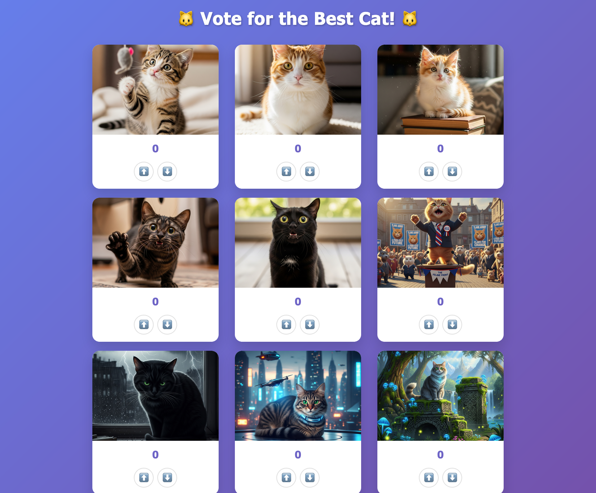

import FileTree from '@components/vendored/starlight/FileTree.astro';
import { Code, Tabs, TabItem } from '@astrojs/starlight/components';

During the setup phase, you're going to:

- Setup a Git repository where this project will live.
- Install all required dependencies (if you haven't already).
- Set up the NodeJS application that you're going to deploy to the cloud.
- Acquire the assets used for the application.

Let's get building!

## Create the Git repository

Create a new Git project where we're going to store the IaC for our live infrastructure.

```bash
mkdir terralith-to-terragrunt
cd terralith-to-terragrunt
git init
```

## Install dependencies with `mise`

(Assuming you are using it) Use `mise` to download, install and pin the version of tools you're going to use in this project.

```bash
mise use terragrunt@0.83.2
mise use opentofu@1.10.3
mise use aws@2.27.63
mise use node@22.17.1
```

You should now have a local `mise.toml` file that looks like the following with all the tools pinned that you need.

import miseToml from '../../../../fixtures/terralith-to-terragrunt/mise.toml?raw';

<Code title="mise.toml" lang="toml" code={miseToml} />

## Setting up the app

Now that you have the tools installed that are going to be used for this project, you'll want to setup the application we're going to be managing throughout the project.

It's not a very interesting application (it was vibe coded pretty quickly), and the details of how it works aren't that important to the topic of this blog post. Corners were also cut when designing the application to minimize the resources you have to provision, so don't design any of your applications based on what you see there.

### Create the application directory structure

First, create the application directory structure:

```bash
mkdir -p app/best-cat
cd app/best-cat
```

Next, copy the application files into the new directory you just created.

import packageJson from '../../../../fixtures/terralith-to-terragrunt/app/best-cat/package.json?raw';
import indexJs from '../../../../fixtures/terralith-to-terragrunt/app/best-cat/index.js?raw';
import templateHtml from '../../../../fixtures/terralith-to-terragrunt/app/best-cat/template.html?raw';
import stylesCss from '../../../../fixtures/terralith-to-terragrunt/app/best-cat/styles.css?raw';
import scriptJs from '../../../../fixtures/terralith-to-terragrunt/app/best-cat/script.js?raw';
import packageLockJson from '../../../../fixtures/terralith-to-terragrunt/app/best-cat/package-lock.json?raw';

<Tabs syncKey="app-code">
    <TabItem label="package.json">
        <Code lang="json" code={packageJson} />
    </TabItem>
    <TabItem label="index.js">
        <Code lang="javascript" code={indexJs} />
    </TabItem>
    <TabItem label="template.html">
        <Code lang="html" code={templateHtml} />
    </TabItem>
    <TabItem label="styles.css">
        <Code lang="css" code={stylesCss} />
    </TabItem>
    <TabItem label="script.js">
        <Code lang="javascript" code={scriptJs} />
    </TabItem>
    <TabItem label="package-lock.json">
        <Code lang="json" code={packageLockJson} />
    </TabItem>
</Tabs>

You should end up with an `app/best-cat` directory that looks like this:

<FileTree>
- app
  - best-cat
    - index.js
    - package-lock.json
    - package.json
    - script.js
    - styles.css
    - template.html
</FileTree>

## Packaging the app

Once you have the app stored in `app/best-cat`, you'll want to create the `dist` directory, then package the application for delivery to a lambda function.

```bash
mkdir dist
cd app/best-cat
npm i
npm run package
```

I also recommend adding the following `.gitignore` file to your `dist` directory so you don't accidentally commit any other content in this directory to your repository:

```bash
# dist/.gitignore

*
!.gitignore
```

## Generating assets

You'll also want some assets to use in this project to make it more fun. I generated a bunch of cat pictures using [Gemini](https://gemini.google.com/), but feel free to use stock photos or something else to generate the assets.

I would recommend that you place the images in the same location I did (`dist/static`), so that the convenience scripts I wrote work out of the box without modification.

This is what my `dist` directory looks like after following these steps:

<FileTree>
- dist
  - best-cat.zip
  - static
    - 01-cat.png
    - 02-cat.png
    - 03-cat.png
    - 04-cat.png
    - 05-cat.png
    - 06-cat.png
    - 07-cat.png
    - 08-cat.png
    - 09-cat.png
    - 10-cat.png
</FileTree>

Our end goal is to host a site that looks like this in AWS using these artifacts:


