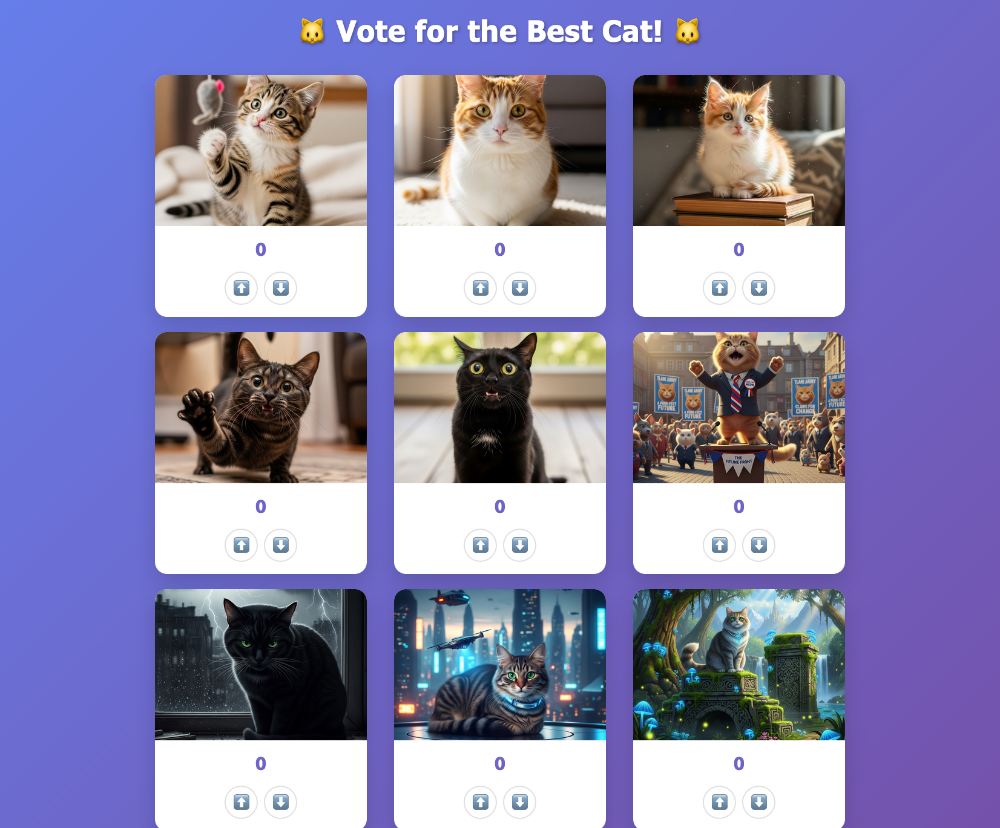

import { FileTree } from '@astrojs/starlight/components';

During this step we're going to take the contents of the `dist` directory, and deploy the application in AWS using OpenTofu. The content that we're going to create here is not intended to be a best-practices IaC setup, but rather what one might do if they were to naively put together the IaC for this application from scratch without knowledge of best practices, or planning for future modifications.

This will be reiterated at the end of this step, but note that this statement is not intended to be judgemental. There are perfectly valid reasons for building an MVP quickly without worrying about architecting the most optimally scaling IaC setup from day 1, and everyone has to start somewhere in their IaC journey.

As you progress through this guide, you'll be exposed to the challenges that might arise if you design your IaC as prescribed at each step, and this guide will do its best to highlight those trade-offs. The goal is for you to be able to make judgements around the IaC design that is best suited to your infrastructure management.

## Tutorial

To start, create the `live` directory where you're going to be provisioning some infrastructure. Creating a dedicated `live` directory/repository separate from reusable infrastructure patterns is an established recommended best practice from Gruntwork that will become important in later iterations.

```bash
mkdir live
```

To get started, we'll want to define our [providers](https://opentofu.org/docs/language/providers/), which is how OpenTofu will actually effectuate infrastructure in AWS.

```hcl
# live/providers.tf

provider "aws" {
  region = var.aws_region
}
```

Don't worry about that `var.aws_region` bit there. We'll define it later. When we do, we'll be defining the region in which AWS will have resources provisioned.

It's best practice to tell OpenTofu what your version constraints are, so that your IaC is reliably reusable. You'll pin version `>= 1.10` of OpenTofu here, as you're going to be using an OpenTofu 1.10+ feature later on, and you'll pin version `~> 6.0` because any change that makes the `resource` definitions we define here break *should* be in a future major release of the `aws` provider.

```hcl
# live/versions.tf

terraform {
  required_version = ">= 1.10"
  required_providers {
    aws = {
      source  = "hashicorp/aws"
      version = "~> 6.0"
    }
  }
}
```

Now define the resources that are provisioned in this step.

First, we'll add the database that we use to provision resources in this project. For this guide, we'll be using DynamoDB, which is a fast, NoSQL database offered by AWS. The primary construct in DynamoDB is a table. All DynamoDB tables have a name, and a primary key (also called the hash key). This is what we'll use to uniquely reference items in the table.

In this project, DynamoDB tables will be used to store the metadata about cats and the number of votes they've gotten as being the best cat.

```hcl
# live/ddb.tf

resource "aws_dynamodb_table" "asset_metadata" {
  name         = "${var.name}-asset-metadata"
  billing_mode = "PAY_PER_REQUEST"
  hash_key     = "image_id"

  attribute {
    name = "image_id"
    type = "S"
  }

  tags = {
    Name = "${var.name}-asset-metadata"
  }
}
```

Next, we'll add our object store. For this guide, we'll be using S3, which is a cheap, scalable object store provided by AWS. The primary construct of S3 is a bucket. All buckets must have a name that is globally unique, so we'll want to make sure that the value we select later on for `name` is appropriately unique.

```hcl
# live/s3.tf

resource "aws_s3_bucket" "static_assets" {
  bucket = "${var.name}-static-assets"

  force_destroy = var.force_destroy
}
```

That `force_destroy` attribute there is important. It determines whether we can destroy the S3 bucket without getting rid of all its contents. You typically want this to be set to `false` in production environments, but it can be convenient to set this to `true` in test/ephemeral environments, where you expect the bucket to be short-lived.

In addition to provisioning resources using OpenTofu, you can also lookup data using `data` configuration blocks. These can be useful ways to access frequently needed data in AWS resources, like AWS account IDs.

```bash
# live/data.tf

data "aws_caller_identity" "current" {}
```

Using that `data` block, let's provision the IAM role that's used for our Lambda function. We'll want it to trust the Lambda service, so that the Lambda function is allowed to assume it, and have permissions to:

1. Get and list the objects in S3 (our cat images).
2. Interact with the DynamoDB table used for storing metadata on our assets (the votes for best cat).
3. Basic permissions required to operate a Lambda function (the ability to log to [CloudWatch Logs](https://docs.aws.amazon.com/AmazonCloudWatch/latest/logs/WhatIsCloudWatchLogs.html)).

```hcl
# live/iam.tf

resource "aws_iam_role" "lambda_role" {
  name = "${var.name}-lambda-role"

  assume_role_policy = jsonencode({
    Version = "2012-10-17"
    Statement = [
      {
        Action = "sts:AssumeRole"
        Effect = "Allow"
        Principal = {
          Service = "lambda.amazonaws.com"
        }
      }
    ]
  })
}

resource "aws_iam_policy" "lambda_s3_read" {
  name        = "${var.name}-lambda-s3-read"
  description = "Policy for Lambda to read from S3 bucket"

  policy = jsonencode({
    Version = "2012-10-17"
    Statement = [
      {
        Effect = "Allow"
        Action = [
          "s3:GetObject",
          "s3:ListBucket"
        ]
        Resource = [
          aws_s3_bucket.static_assets.arn,
          "${aws_s3_bucket.static_assets.arn}/*"
        ]
      }
    ]
  })
}

resource "aws_iam_policy" "lambda_dynamodb" {
  name        = "${var.name}-lambda-dynamodb"
  description = "Policy for Lambda to read/write to DynamoDB table"

  policy = jsonencode({
    Version = "2012-10-17"
    Statement = [
      {
        Effect = "Allow"
        Action = [
          "dynamodb:GetItem",
          "dynamodb:PutItem",
          "dynamodb:UpdateItem",
          "dynamodb:DeleteItem",
          "dynamodb:Query",
          "dynamodb:Scan"
        ]
        Resource = aws_dynamodb_table.asset_metadata.arn
      }
    ]
  })
}

resource "aws_iam_policy" "lambda_basic_execution" {
  name        = "${var.name}-lambda-basic-execution"
  description = "Policy for Lambda basic execution (CloudWatch logs)"

  policy = jsonencode({
    Version = "2012-10-17"
    Statement = [
      {
        Effect = "Allow"
        Action = [
          "logs:CreateLogGroup",
          "logs:CreateLogStream",
          "logs:PutLogEvents"
        ]
        Resource = "arn:aws:logs:${var.aws_region}:${data.aws_caller_identity.current.account_id}:*"
      }
    ]
  })
}

resource "aws_iam_role_policy_attachment" "lambda_s3_read" {
  role       = aws_iam_role.lambda_role.name
  policy_arn = aws_iam_policy.lambda_s3_read.arn
}

resource "aws_iam_role_policy_attachment" "lambda_dynamodb" {
  role       = aws_iam_role.lambda_role.name
  policy_arn = aws_iam_policy.lambda_dynamodb.arn
}

resource "aws_iam_role_policy_attachment" "lambda_basic_execution" {
  role       = aws_iam_role.lambda_role.name
  policy_arn = aws_iam_policy.lambda_basic_execution.arn
}
```

The final resource you're going to provision is the Lambda function. Lambda functions are a form of cheap, ephemeral compute that are especially useful for demo guides like this where you might forget to clean up some dummy resources. They won't cost you anything while they're not doing anything!

```hcl
# live/lambda.tf

resource "aws_lambda_function" "main" {
  function_name = "${var.name}-function"

  filename         = var.lambda_zip_file
  source_code_hash = filebase64sha256(var.lambda_zip_file)

  role = aws_iam_role.lambda_role.arn

  handler       = var.lambda_handler
  runtime       = var.lambda_runtime
  timeout       = var.lambda_timeout
  memory_size   = var.lambda_memory_size
  architectures = var.lambda_architectures

  environment {
    variables = {
      S3_BUCKET_NAME      = aws_s3_bucket.static_assets.bucket
      DYNAMODB_TABLE_NAME = aws_dynamodb_table.asset_metadata.name
    }
  }

  depends_on = [
    aws_iam_role_policy_attachment.lambda_s3_read,
    aws_iam_role_policy_attachment.lambda_dynamodb,
    aws_iam_role_policy_attachment.lambda_basic_execution
  ]
}

resource "aws_lambda_function_url" "main" {
  function_name      = aws_lambda_function.main.function_name
  authorization_type = "NONE"
}
```

Now let's add some variables that we want to specify for this project. You can think of these as the *inputs* that you supply to your generically defined IaC to get infrastructure customized to your needs. As a matter of best practice, we're going to separate the required variables from the optional ones.

```hcl
# live/vars-required.tf

variable "name" {
  description = "Name used for all resources"
  type        = string
}

variable "lambda_zip_file" {
  description = "Path to the Lambda function zip file"
  type        = string
}
```

```hcl
# live/vars-optional.tf

variable "aws_region" {
  description = "AWS region for all resources"
  type        = string
  default     = "us-east-1"
}

variable "lambda_runtime" {
  description = "Lambda function runtime"
  type        = string
  default     = "nodejs22.x"
}

variable "lambda_handler" {
  description = "Lambda function handler"
  type        = string
  default     = "index.handler"
}

variable "lambda_timeout" {
  description = "Lambda function timeout in seconds"
  type        = number
  default     = 30
}

variable "lambda_memory_size" {
  description = "Lambda function memory size in MB"
  type        = number
  default     = 128
}

variable "lambda_architectures" {
  description = "Lambda function architectures"
  type        = list(string)
  default     = ["arm64"]
}

variable "force_destroy" {
  description = "Force destroy S3 buckets (only set to true for testing or cleanup of demo environments)"
  type        = bool
  default     = false
}

```

Also add an `.auto.tfvars` file to define values for these variables automatically. This isn't strictly required as you'll be prompted for the values of required variables interactively if you don't supply them here, but it does make your life easier.

Note that you'll want to make sure that `name` is set to something globally unique, as it'll be used as part of an S3 bucket name, which might conflict with a bucket created by somebody else otherwise (a simple way to decrease your odds of a collision is to use something like the date in your bucket name).

```hcl
# live/.auto.tfvars

# Required: Name used for all resources (must be unique)
name = "best-cat-2025-07-31-01"

# Required: Path to your Lambda function zip file
lambda_zip_file = "../dist/best-cat.zip"
```

You'll also want to add some *outputs* so that you can easily interact with the infrastructure you create.

```hcl
# live/outputs.tf

output "lambda_function_url" {
  description = "URL of the Lambda function"
  value       = aws_lambda_function_url.main.function_url
}

output "lambda_function_name" {
  description = "Name of the Lambda function"
  value       = aws_lambda_function.main.function_name
}

output "s3_bucket_name" {
  description = "Name of the S3 bucket for static assets"
  value       = aws_s3_bucket.static_assets.bucket
}

output "s3_bucket_arn" {
  description = "ARN of the S3 bucket for static assets"
  value       = aws_s3_bucket.static_assets.arn
}

output "dynamodb_table_name" {
  description = "Name of the DynamoDB table for asset metadata"
  value       = aws_dynamodb_table.asset_metadata.name
}

output "dynamodb_table_arn" {
  description = "ARN of the DynamoDB table for asset metadata"
  value       = aws_dynamodb_table.asset_metadata.arn
}

output "lambda_role_arn" {
  description = "ARN of the Lambda execution role"
  value       = aws_iam_role.lambda_role.arn
}
```

As a best practice, you'll want to add a `backend` configuration so that state isn't stored locally. This is important if you want to collaborate with others in infrastructure management. Note that you'll likely want to change the name of the bucket you use here, as it also has to be globally unique to avoid conflicts with anyone else.

```hcl
# live/backend.tf

terraform {
  backend "s3" {
    bucket       = "terragrunt-to-terralith-blog-step-1-2025-07-31-01"
    key          = "tofu.tfstate"
    region       = "us-east-1"
    encrypt      = true
    use_lockfile = true
  }
}
```

Note that we're using the special new ✨ lockfile-based state locking ✨ made available in OpenTofu 1.10! This is especially convenient for this guide, as it saves us from provisioning an additional DynamoDB table to handle state locking.

Unfortunately, OpenTofu will not provision this bucket for us automatically, so we will have to provision that manually.

```bash
aws s3api create-bucket --bucket 'terragrunt-to-terralith-blog-step-1-2025-07-31-01' --region 'us-east-1'
aws s3api put-bucket-versioning --bucket 'terragrunt-to-terralith-blog-2025-07-31-01' --versioning-configuration 'Status=Enabled'
```

## Project Layout Check-in

At this stage, you should have a `live` directory that looks like this:

<FileTree>
- live
  - backend.tf
  - data.tf
  - ddb.tf
  - iam.tf
  - lambda.tf
  - outputs.tf
  - providers.tf
  - s3.tf
  - vars-optional.tf
  - vars-required.tf
  - versions.tf
</FileTree>


## Applying Updates

We can now apply our live infrastructure!

```bash
cd live
tofu init
tofu apply
```

You'll receive a prompt to approve the apply (type `yes` then enter to continue).

Make sure to review the plan thoroughly, then approve it. Assuming everything went well, you'll see a bunch of outputs at the end of the apply. One of them will be an output that looks like the following:

```text
lambda_function_url = "https://somerandomcharacters.lambda-url.us-east-1.on.aws/"
```

Copy that link, and paste it into your browser to see a page like the following:


Congratulations! You've got live infrastructure you built yourself running in AWS!

We can see an error that the site doesn't have any images, and a prompt to upload some cat pictures to get started. To get those pictures uploaded, we'll want to grab the name of the S3 bucket, and use the AWS CLI to upload the assets.

```bash
# (Assuming you're using bash or zsh and you're in the `live` directory).

# Grab the bucket name into the `bucket_name` variable.
bucket_name="$(tofu output -raw s3_bucket_name)"

# Navigate to the root of the git repository.
cd "$(git rev-parse --show-toplevel)"

# Navigate to the directory where you stored your cat pictures.
cd dist/static

# Use the AWS CLI to sync the assets to the bucket.
aws s3 sync . "s3://${bucket_name}/"
```

If you reload the website, you should be able to see the cat images you uploaded.



## Wrap Up

You've successfully built and deployed a complete, serverless web application using OpenTofu!

All of your infrastructure including:

- An S3 bucket
- A DynamoDB table
- An IAM role
- A Lambda function

Are defined and managed within a single root module. This configuration, could be called a "Terralith" or "Megamodule," but it's probably not obvious that there's anything wrong with this setup. This a common and perfectly acceptable starting point for many projects. It's simple and direct, but as you continue to adjust and refactor this project, its monolithic nature will present challenges in reusability and safe environment management as you scale. In the next step, you'll begin to address these challenges by refactoring your code into reusable modules.
