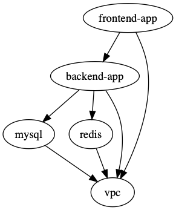

import FileTree from '@components/vendored/starlight/FileTree.astro';
import { Aside } from '@astrojs/starlight/components';

## What are Stacks?

A **stack** in Terragrunt is a collection of related units that can be managed together. Stacks provide a way to:

- Deploy multiple infrastructure components with a single command
- Manage dependencies between units automatically
- Control the blast radius of changes
- Organize infrastructure into logical groups

Terragrunt supports two approaches to defining stacks:

1. **Implicit Stacks**: Created by organizing units in a directory structure.
2. **Explicit Stacks**: Defined using `terragrunt.stack.hcl` files.

## Implicit Stacks

The simplest way to create a stack is to organize your units in a directory structure in your repository. When you have multiple units in a directory, Terragrunt automatically treats that directory as a stack for the purposes of commands like `terragrunt run --all apply`.

### Converting Terraform Modules to Units

Let's say your infrastructure is defined across multiple OpenTofu/Terraform root modules:

<FileTree>

- root
  - backend-app
    - main.tf
  - frontend-app
    - main.tf
  - mysql
    - main.tf
  - valkey
    - main.tf
  - vpc
    - main.tf

</FileTree>

To convert these to Terragrunt units, simply add a `terragrunt.hcl` file to each directory:

<FileTree>

- root
  - backend-app
    - main.tf
    - terragrunt.hcl
  - frontend-app
    - main.tf
    - terragrunt.hcl
  - mysql
    - main.tf
    - terragrunt.hcl
  - valkey
    - main.tf
    - terragrunt.hcl
  - vpc
    - main.tf
    - terragrunt.hcl

</FileTree>

Now you have an **implicit stack**! The `root` directory contains all your units and can be managed as a single stack.

### Working with Implicit Stacks

Use the [`--all` flag](/docs/reference/cli/commands/run/#all) to run an OpenTofu/Terraform command on all units in the implicit stack in the current working directory:

```bash
# Deploy all units discovered in the current working directory
terragrunt run --all apply

# Plan changes across all units discovered in the current working directory
terragrunt run --all plan

# Destroy all units discovered in the current working directory
terragrunt run --all destroy

# View outputs from all units discovered in the current working directory
terragrunt run --all output
```

You can also use the [`--graph` flag](/docs/reference/cli/commands/run/#graph) to run an OpenTofu/Terraform command on all units in the [DAG](/docs/getting-started/terminology/#directed-acyclic-graph-dag) of the unit in the current working directory.

```bash
# Run an OpenTofu/Terraform command on all units in the DAG of the unit in the current working directory
terragrunt run --graph apply
```

### Advantages of Implicit Stacks

- **Simple**: Just organize units in directory trees.
- **Familiar**: Organized following best practices for OpenTofu/Terraform repository structures.
- **Flexible**: Easy to add/remove units by creating/deleting directories.
- **Version Control Friendly**: Each unit is a separate directory with its own history.
- **Backwards Compatible**: This has been the default way to work with Terragrunt for over eight years, and the majority of existing Terragrunt configurations use this approach.

### Limitations of Implicit Stacks

- **Manual Management**: Each unit must be manually created and configured.
- **No Reusability**: Patterns can't be easily shared across environments.
- **Repetitive**: Similar configurations must be duplicated or referenced from [includes](/docs/features/includes).

## Explicit Stacks

For an alternate approach (that is more flexible, but not necessarily always the better solution), you can define explicit stacks using `terragrunt.stack.hcl` files. These are **blueprints** that programmatically generate units at runtime.

### What is a terragrunt.stack.hcl file?

A `terragrunt.stack.hcl` file is a blueprint that defines how to generate Terragrunt configurations programmatically. It tells Terragrunt:

- What units to create.
- Where to get their configurations from.
- Where to place them in the directory structure.
- What values to pass to each unit.

### Supported Configuration Blocks

#### `unit` blocks - Define Individual Infrastructure Components

- **Purpose**: Define a single, deployable piece of infrastructure.
- **Use case**: When you want to create a single piece of isolated infrastructure (e.g. a specific VPC, database, or application).
- **Result**: Generates a directory with a single `terragrunt.hcl` file in the specified `path` from the specified `source`.

#### `stack` blocks - Define Reusable Infrastructure Patterns

- **Purpose**: Define a stack of units to be deployed together.
- **Use case**: When you have a common, multi-unit pattern (like "dev environment" or "three-tier web application") that you want to deploy multiple times.
- **Result**: Generates a directory with another `terragrunt.stack.hcl` file in the specified `path` from the specified `source`.

### Example: Simple Stack with Units

```hcl
# terragrunt.stack.hcl

unit "vpc" {
  source = "git::git@github.com:acme/infrastructure-catalog.git//units/vpc?ref=v0.0.1"
  path   = "vpc"
  values = {
    vpc_name = "main"
    cidr     = "10.0.0.0/16"
  }
}

unit "database" {
  source = "git::git@github.com:acme/infrastructure-catalog.git//units/database?ref=v0.0.1"
  path   = "database"
  values = {
    engine   = "postgres"
    version  = "13"
    vpc_path = "../vpc"
  }
}
```

Running `terragrunt stack generate` in the directory containing that `terragrunt.stack.hcl` file generates:

<FileTree>

- .terragrunt-stack
  - vpc
    - terragrunt.hcl
    - terragrunt.values.hcl
  - database
    - terragrunt.hcl
    - terragrunt.values.hcl

</FileTree>

<Aside type="note">
Note that the contents are generated into a `.terragrunt-stack` directory. This is to make it convenient to add `.terragrunt-stack` to your `.gitignore` file, and always generate the stack on demand instead of checking it in.

Also note the `terragrunt.values.hcl` files generated next to the `terragrunt.hcl` files of the units. These files contain the values specified in the `values` block for the unit.
</Aside>

### Example: Nested Stack with Reusable Patterns

```hcl
# terragrunt.stack.hcl

stack "dev" {
  source = "git::git@github.com:acme/infrastructure-catalog.git//stacks/environment?ref=v0.0.1"
  path   = "dev"
  values = {
    environment = "development"
    cidr        = "10.0.0.0/16"
  }
}

stack "prod" {
  source = "git::git@github.com:acme/infrastructure-catalog.git//stacks/environment?ref=v0.0.1"
  path   = "prod"
  values = {
    environment = "production"
    cidr        = "10.1.0.0/16"
  }
}
```

The referenced stack might contain:

```hcl
# stacks/environment/terragrunt.stack.hcl

unit "vpc" {
  source = "git::git@github.com:acme/infrastructure-catalog.git//units/vpc?ref=v0.0.1"
  path   = "vpc"
  values = {
    vpc_name = values.environment
    cidr     = values.cidr
  }
}

unit "database" {
  source = "git::git@github.com:acme/infrastructure-catalog.git//units/database?ref=v0.0.1"
  path   = "database"
  values = {
    environment = values.environment
    vpc_path    = "../vpc"
  }
}
```

Running `terragrunt stack generate` in the directory containing that `terragrunt.stack.hcl` file generates:

<FileTree>

- .terragrunt-stack
  - dev
    - terragrunt.stack.hcl
    - .terragrunt-stack
      - vpc
        - terragrunt.hcl
        - terragrunt.values.hcl
      - database
        - terragrunt.hcl
        - terragrunt.values.hcl
  - prod
    - terragrunt.stack.hcl
    - .terragrunt-stack
      - vpc
        - terragrunt.hcl
        - terragrunt.values.hcl
      - database
        - terragrunt.hcl
        - terragrunt.values.hcl

</FileTree>

### Working with Explicit Stacks

```bash
# Generate units from the `terragrunt.stack.hcl` file in the current
# working directory (and all stacks in child directories).
terragrunt stack generate

# Deploy all generated units defined using the `terragrunt.stack.hcl` file
# in the current working directory (and any units generated by stacks in this file).
#
# Note that this will also automatically generate the stack if it is not already generated.
terragrunt stack run apply
```

### Advantages of Explicit Stacks

- **Reusability**: Define patterns once, reuse them across environments.
- **Consistency**: Ensure all environments follow the same structure.
- **Version Control**: Version collections of infrastructure patterns alongside the units of infrastructure that make them up.
- **Automation**: Generate complex infrastructure from simple blueprints.
- **Flexibility**: Easy to create variations with different values.

### Limitations of Explicit Stacks

- **Complexity**: Requires understanding another configuration file.
- **Generation Overhead**: Units must be generated before use.
- **Debugging**: Generated files can be harder to debug if you accidentally generate files that are not what you intended.

## Choosing Between Implicit and Explicit Stacks

### Use Implicit Stacks When:

- You have a small number of units.
- Each unit is unique and not repeated across environments.
- You don't mind a high file count.
- You're just getting started with Terragrunt.
- You need maximum explicitness and transparency.

### Use Explicit Stacks When:

- You have multiple environments (dev, staging, prod).
- You want to reuse collections of related infrastructure patterns.
- You have many similar units that differ only in values.
- You want to version collections of infrastructure patterns.
- You're building infrastructure catalogs or templates.

## The Complete Workflow

### For Implicit Stacks:

1. **Organize**: Create directories for each unit with `terragrunt.hcl` files.
2. **Configure**: Set up inputs, dependencies, etc. in each unit.
3. **Deploy**: Use `terragrunt run --all apply` to deploy all units.

### For Explicit Stacks:

1. **Catalog**: Create a catalog of infrastructure patterns (using `terragrunt.hcl` files, `terragrunt.stack.hcl` files, etc.) in a Git repository.
2. **Author**: Write a `terragrunt.stack.hcl` file with `unit` and/or `stack` blocks.
3. **Generate**: Run `terragrunt stack generate` to create the actual units\*.
4. **Deploy**: Run `terragrunt stack run apply` to deploy all units\*\*.

\* Multiple commands (like `stack run` or `run --all`) automatically generate units from `terragrunt.stack.hcl` files for you.

\*\* You can also just use `run --all apply` to deploy all units in the stack like you can with implicit stacks.

## Common Patterns

For detailed examples, see the [Gruntwork Terragrunt Infrastructure Catalog Stack Examples](https://github.com/gruntwork-io/terragrunt-infrastructure-catalog-example/tree/main/examples/terragrunt/stacks).

## Passing outputs between units

Consider the following file structure:

<FileTree>

- root
  - backend-app
    - terragrunt.hcl
  - mysql
    - terragrunt.hcl
  - valkey
    - terragrunt.hcl
  - vpc
    - terragrunt.hcl

</FileTree>

Suppose that you wanted to pass in the VPC ID of the VPC that is created from the `vpc` unit in the directory structure above to the `mysql` unit as an input variable. Or that you wanted to pass in the subnet IDs of the private subnet that is allocated as part of the `vpc` unit.

You can use the `dependency` block to extract those outputs and use them as `inputs` to the `mysql` unit.

For example, suppose the `vpc` unit outputs the ID under the output named `vpc_id`. To access that output, you would specify in `mysql/terragrunt.hcl`:

```hcl
# mysql/terragrunt.hcl
dependency "vpc" {
  config_path = "../vpc"
}

inputs = {
  vpc_id = dependency.vpc.outputs.vpc_id
}
```

When you apply this unit, the output will be read from the `vpc` unit and passed in as an input to the `mysql` unit right before calling `tofu apply`/`terraform apply`.

You can also specify multiple `dependency` blocks to access the outputs of multiple units.

For example, in the above folder structure, you might want to reference the `domain` output of the `valkey` and `mysql` units for use as `inputs` in the `backend-app` unit. To access those outputs, you would specify the following in `backend-app/terragrunt.hcl`:

```hcl
# backend-app/terragrunt.hcl
dependency "mysql" {
  config_path = "../mysql"
}

dependency "valkey" {
  config_path = "../valkey"
}

inputs = {
  mysql_url = dependency.mysql.outputs.domain
  valkey_url = dependency.valkey.outputs.domain
}
```

Note that each `dependency` block results in a relevant status in the Terragrunt [DAG](/docs/getting-started/terminology/#directed-acyclic-graph-dag). This means that when you run `run --all apply` on a config that has `dependency` blocks, Terragrunt will not attempt to deploy the config until all the units referenced in `dependency` blocks have been applied. So for the above example, the order for the `run --all apply` command would be:

1. Deploy the VPC

2. Deploy MySQL and valkey in parallel

3. Deploy the backend-app

If any of the units failed to deploy, then Terragrunt will not attempt to deploy the units that depend on them.

**Note**: Not all blocks can access outputs passed by `dependency` blocks. See the section on [Configuration parsing order](/docs/reference/hcl#configuration-parsing-order) for more information.

### Unapplied dependency and mock outputs

Terragrunt will return an error if the unit referenced in a `dependency` block has not been applied yet. This is because you cannot actually fetch outputs out of an unapplied unit, even if there are no resources being created in the unit.

This is most problematic when running commands that do not modify state (e.g `run --all plan` and `run --all validate`) on a completely new setup where no infrastructure has been deployed. You won't be able to `plan` or `validate` a unit if you can't determine the `inputs`. If the unit depends on the outputs of another unit that hasn't been applied yet, you won't be able to compute the `inputs` unless the dependencies are all applied.

Of course, in real life usage, you typically need the ability to run `run --all validate` or `run --all plan` on a completely new set of infrastructure.

To address this, you can provide mock outputs to use when a unit hasn't been applied yet. This is configured using the `mock_outputs` attribute on the `dependency` block and it corresponds to a map that will be injected in place of the actual dependency outputs if the target config hasn't been applied yet.

Using a mock output is typically the best solution here, as you typically don't actually care that an _accurate_ value is used for a given value at this stage, just that it will plan successfully. When you actually apply the unit, that's when you want to be sure that a real value is used.

For example, in the previous scenario with a `mysql` unit and `vpc` unit, suppose you wanted to mock a value for the `vpc_id` during a `run --all validate` for the `mysql` unit.

You can specify that in `mysql/terragrunt.hcl`:

```hcl
# mysql/terragrunt.hcl
dependency "vpc" {
  config_path = "../vpc"

  mock_outputs = {
    vpc_id = "mock-vpc-id"
  }
}

inputs = {
  vpc_id = dependency.vpc.outputs.vpc_id
}
```

You can now run `validate` on this config before the `vpc` unit is applied because Terragrunt will use the map `{vpc_id = "mock-vpc-id"}` as the `outputs` attribute on the dependency instead of erroring out.

What if you wanted to restrict this behavior to only the `validate` command? For example, you might not want to use the defaults for a `plan` operation because the plan doesn't give you any indication of what is actually going to be created.

You can use the `mock_outputs_allowed_terraform_commands` attribute to indicate that the `mock_outputs` should only be used when running those OpenTofu/Terraform commands. So to restrict the `mock_outputs` to only when `validate` is being run, you can modify the above `terragrunt.hcl` file to:

```hcl
# mysql/terragrunt.hcl
dependency "vpc" {
  config_path = "../vpc"

  mock_outputs = {
    vpc_id = "temporary-dummy-id"
  }

  mock_outputs_allowed_terraform_commands = ["validate"]
}

inputs = {
  vpc_id = dependency.vpc.outputs.vpc_id
}
```

Note that indicating `validate` means that the `mock_outputs` will be used either with `validate` or with `run --all validate`.

You can also use `skip_outputs` on the `dependency` block to specify the dependency without pulling in the outputs:

```hcl
# mysql/terragrunt.hcl
dependency "vpc" {
  config_path = "../vpc"

  skip_outputs = true
}
```

When `skip_outputs` is used with `mock_outputs`, mocked outputs will be returned without attempting to load outputs from OpenTofu/Terraform.

This can be useful when you disable backend initialization (`remote_state.disable_init`) in CI for example.

```hcl
# mysql/terragrunt.hcl
dependency "vpc" {
  config_path = "../vpc"

  mock_outputs = {
    vpc_id = "temporary-dummy-id"
  }

  skip_outputs = true
}
```

You can also use `mock_outputs_merge_strategy_with_state` on the `dependency` block to merge mocked outputs and real outputs:

```hcl
# mysql/terragrunt.hcl
dependency "vpc" {
  config_path = "../vpc"

  mock_outputs = {
    vpc_id     = "temporary-dummy-id"
    new_output = "temporary-dummy-value"
  }

  mock_outputs_merge_strategy_with_state = "shallow"
}
```

If real outputs only contain `vpc_id`, `dependency.outputs` will contain a real value for `vpc_id` and a mocked value for `new_output`.

### Passing outputs between units in explicit stacks

When defining units using a `terragrunt.stack.hcl` file, you might need to perform some indirection to pass outputs between units, as the dependency relationship of each unit is explicitly defined in each unit's `terragrunt.hcl` file.

For example, say you wanted to generate the stack above using the following `terragrunt.stack.hcl` file:

```hcl
# terragrunt.stack.hcl

unit "vpc" {
  source = "github.com/acme/infrastructure-catalog//units/vpc?ref=v1.0.0"
  path   = "vpc"
}

unit "mysql" {
  source = "github.com/acme/infrastructure-catalog//units/mysql?ref=v1.0.0"
  path   = "mysql"
}

unit "valkey" {
  source = "github.com/acme/infrastructure-catalog//units/valkey?ref=v1.0.0"
  path   = "valkey"
}

unit "backend_app" {
  source = "github.com/acme/infrastructure-catalog//units/backend-app?ref=v1.0.0"
  path   = "backend-app"
}
```

Generating this stack would generate the following:

<FileTree>

- .terragrunt-stack
  - vpc
    - terragrunt.hcl
  - mysql
    - terragrunt.hcl
  - valkey
    - terragrunt.hcl
  - backend-app
    - terragrunt.hcl

</FileTree>

The `backend-app` unit would need to access the outputs of the `mysql` and `valkey` units to use as inputs. To do this, you can use the `dependency` block to access the outputs of the `mysql` and `backend-app` units.

```hcl
# github.com/acme/infrastructure-catalog//units/mysql/terragrunt.hcl
dependency "vpc" {
  config_path = values.vpc_path
}

inputs = {
  vpc_id = dependency.vpc.outputs.vpc_id
}
```

```hcl
# github.com/acme/infrastructure-catalog//units/backend-app/terragrunt.hcl
dependency "mysql" {
  config_path = values.mysql_path
}

dependency "valkey" {
  config_path = values.valkey_path
}

inputs = {
  mysql_url = dependency.mysql.outputs.domain
  valkey_url = dependency.valkey.outputs.domain
}
```

And update the `terragrunt.stack.hcl` file to:

```hcl
# terragrunt.stack.hcl

unit "vpc" {
  source = "github.com/acme/infrastructure-catalog//units/vpc?ref=v1.0.0"
  path   = "vpc"
}

unit "mysql" {
  source = "github.com/acme/infrastructure-catalog//units/mysql?ref=v1.0.0"
  path   = "mysql"
  values = {
    vpc_path = "../vpc"
  }
}

unit "valkey" {
  source = "github.com/acme/infrastructure-catalog//units/valkey?ref=v1.0.0"
  path   = "valkey"
  values = {
    vpc_path = "../vpc"
  }
}

unit "backend_app" {
  source = "github.com/acme/infrastructure-catalog//units/backend-app?ref=v1.0.0"
  path   = "backend-app"
  values = {
    mysql_path  = "../mysql"
    valkey_path = "../valkey"
  }
}
```

Following this pattern, the path to dependencies are passed in as `values` to the unit, and units themselves define dependency blocks that utilize those values.

<Aside type="note">
You might not like this design!

Take a look at RFC [#4067](https://github.com/gruntwork-io/terragrunt/issues/4067) for an alternate proposal from a member of the Terragrunt community, and follow the conversation there.
</Aside>

## Stack outputs

When defining a stack using a `terragrunt.stack.hcl` file, you also have the ability to interact with the aggregated outputs of all the units in the stack from the CLI.

To do this, use the [`stack output`](/docs/reference/cli/commands/stack/output) command (not the [`stack run output`](/docs/reference/cli/commands/stack/run) command).

```bash
$ terragrunt stack output
backend_app = {
  domain = "backend-app.example.com"
}
frontend_app = {
  domain = "frontend-app.example.com"
}
mysql = {
  endpoint = "terraform-20250504140737772400000001.abcdefghijkl.us-east-1.rds.amazonaws.com"
}
valkey = {
  endpoint = "serverless-valkey-01.amazonaws.com"
}
vpc = {
  vpc_id = "vpc-1234567890"
}
```

This returns a single aggregated HCL object aggregating all the outputs for all the units within the stack.

<Aside type="tip">
You can use the `--format json` flag to get the output in JSON format, which can be useful for accessing values programmatically.
</Aside>

## Dependencies between units

You can also specify dependencies without accessing any of the outputs of units. Consider the following file structure:

<FileTree>

- root
  - backend-app
    - terragrunt.hcl
  - frontend-app
    - terragrunt.hcl
  - mysql
    - terragrunt.hcl
  - valkey
    - terragrunt.hcl
  - vpc
    - terragrunt.hcl

</FileTree>

Let's assume you have the following dependencies between OpenTofu/Terraform units:

- `backend-app` depends on `mysql`, `valkey`, and `vpc`

- `frontend-app` depends on `backend-app` and `vpc`

- `mysql` depends on `vpc`

- `valkey` depends on `vpc`

- `vpc` has no dependencies

You can express these dependencies in your `terragrunt.hcl` config files using a `dependencies` block. For example, in `backend-app/terragrunt.hcl` you would specify:

``` hcl
# backend-app/terragrunt.hcl
dependencies {
  paths = ["../vpc", "../mysql", "../valkey"]
}
```

Similarly, in `frontend-app/terragrunt.hcl`, you would specify:

``` hcl
# frontend-app/terragrunt.hcl
dependencies {
  paths = ["../vpc", "../backend-app"]
}
```

Once you've specified these dependencies in each `terragrunt.hcl` file, Terragrunt will be able to perform updates respecting the [DAG](/docs/getting-started/terminology/#directed-acyclic-graph-dag) of dependencies.

For the example at the start of this section, the order of runs for the `run --all apply` command would be:

1. Deploy the VPC

2. Deploy MySQL and valkey in parallel

3. Deploy the backend-app

4. Deploy the frontend-app

Any error encountered in an individual unit during a `run --all` command will prevent Terragrunt from proceeding with the deployment of any dependent units.

To check all of your dependencies and validate the code in them, you can use the `run --all validate` command.

<Aside type="note">
During `destroy` runs, Terragrunt will try to find all dependent units and show a confirmation prompt with a list of detected dependencies.

This is because Terragrunt knows that once resources in a dependency are destroyed, any commands run on dependent units may fail.

For example, if `destroy` was called on the `Valkey` unit, you'd be asked for confirmation, as the `backend-app` depends on `Valkey`. You can suppress the prompt by using the `--non-interactive` flag.
</Aside>

## Visualizing the DAG

To visualize the dependency graph you can use the `dag graph` command (similar to the `terraform graph` command), or its equivalent `list --format=dot --dependencies --external` command.

The graph is output in DOT format. The typical program used to render this file format is GraphViz, but many web services are available that can do this as well.

```bash
terragrunt dag graph | dot -Tsvg > graph.svg
# Or equivalently:
terragrunt list --format=dot --dependencies --external | dot -Tsvg > graph.svg
```

The example above generates the following graph:



Note that this graph shows the dependency relationship in the direction of the arrow, with the tip pointing to the dependency (e.g. `frontend-app` depends on `backend-app`).

For most commands, Terragrunt will run in the opposite direction, however (e.g. `backend-app` would be applied before `frontend-app`).

The exception to this rule is during the `destroy` (and `plan -destroy`) command, where Terragrunt will run in the direction of the arrow (e.g. `frontend-app` would be destroyed before `backend-app`).

## Testing multiple units locally

If you are using Terragrunt to download [remote OpenTofu/Terraform modules](/docs/features/units/#remote-opentofuterraform-modules) and all of your units have the `source` parameter set to a Git URL, but you want to test with a local checkout of the code, you can use the `--source` parameter to override that value:

```bash
terragrunt run --all plan --source /source/modules
```

If you set the `--source` parameter, the `run --all` command will assume that parameter is pointing to a folder on your local file system that has a local checkout of all of your OpenTofu/Terraform modules.

For each unit that is being processed via a `run --all` command, Terragrunt will:

1. Read in the `source` parameter in that unit's `terragrunt.hcl` file.
2. Parse out the path (the portion after the double-slash).
3. Append the path to the `--source` parameter to create the final local path for that unit.

For example, consider the following `terragrunt.hcl` file:

``` hcl
# terragrunt.hcl

terraform {
  source = "git::git@github.com:acme/infrastructure-modules.git//networking/vpc?ref=v0.0.1"
}
```

Running the following:

```bash
terragrunt run --all apply --source /source/infrastructure-modules
```

Will result in a unit with the configuration for the source above being resolved to `/source/infrastructure-modules//networking/vpc`.

## Limiting run parallelism

By default, Terragrunt will not impose a limit on the number of units it executes when it traverses the dependency graph,
meaning that if it finds 5 units without dependencies, it'll run OpenTofu/Terraform 5 times in parallel, once in each unit.

Sometimes, this can create a problem if there are a lot of units in the dependency graph, like hitting a rate limit on a
cloud provider.

To limit the maximum number of unit executions at any given time use the `--parallelism [number]` flag

```sh
terragrunt run --all apply --parallelism 4
```

## Saving OpenTofu/Terraform plan output

A powerful feature of OpenTofu/Terraform is the ability to [save the result of a plan as a binary or JSON file using the -out flag](https://opentofu.org/docs/cli/commands/plan/).

Terragrunt provides special tooling in `run --all` execution to ensure that the saved plan for a `run --all` against a stack has
a corresponding entry for each unit in the stack in a directory structure that mirrors the stack structure.

To save plan against a stack, use the `--out-dir` flag (or `TG_OUT_DIR` environment variable) as demonstrated below:

```bash
$ terragrunt run --all plan --out-dir /tmp/tfplan
```

<FileTree>

- app1
  - tfplan.tfplan
- app2
  - tfplan.tfplan
- app3
  - tfplan.tfplan
- project-2
  - project-2-app1
    - tfplan.tfplan

</FileTree>

```bash
$ terragrunt run --all --out-dir /tmp/tfplan apply
```

For planning a destroy operation, use the following commands:

```bash
terragrunt run --all --out-dir /tmp/tfplan plan -destroy
terragrunt run --all --out-dir /tmp/tfplan apply
```

To save plan in json format use `--json-out-dir` flag (or `TG_JSON_OUT_DIR` environment variable):

```bash
terragrunt run --all --json-out-dir /tmp/json plan
```

<FileTree>

- app1
  - tfplan.json
- app2
  - tfplan.json
- app3
  - tfplan.json
- project-2
  - project-2-app1
    - tfplan.json

</FileTree>


```bash
terragrunt run --all --out-dir /tmp/all --json-out-dir /tmp/all plan
```

<FileTree>

- app1
  - tfplan.json
  - tfplan.tfplan
- app2
  - tfplan.json
  - tfplan.tfplan
- app3
  - tfplan.json
  - tfplan.tfplan
- project-2
  - project-2-app1
    - tfplan.json
    - tfplan.tfplan

</FileTree>

To recap:

- The plan for each unit in a stack is saved in the same hierarchy as the unit structure.
- The file name for plan binaries are `tfplan.tfplan` and `tfplan.json` for plan JSON.
- JSON plan files can't be used with `terragrunt run --all apply` command, only binary plan files can be used.
- Output directories can be combined which will lead to saving both binary and JSON plans.

## Nested Stacks

Note that you can also have nested stacks.

For example, consider the following file structure:

<FileTree>

- root
  - us-east-1
    - app
      - terragrunt.hcl
    - db
      - terragrunt.hcl
  - us-west-2
    - app
      - terragrunt.hcl
    - db
      - terragrunt.hcl

</FileTree>

In this example, there's the `root` stack, that contains all the infrastructure you've defined so far,
and there's also the `us-east-1` and `us-west-2` stacks, that contain the infrastructure for the `app` and `db` units in those regions.

You can run `run --all` commands at any depth of the stack to run the units in that stack and all of its children.

For example, to run all the units in the `us-east-1` stack, you can run:

```sh
cd root/us-east-1
terragrunt run --all apply
```

Terragrunt will only include the units in the `us-east-1` stack and its children in the queue of units to run (unless external dependencies are pulled in, as discussed in the [run --all command](/docs/reference/cli/commands/run#all)).

Generally speaking, this is the primary tool Terragrunt users use to control the blast radius of their changes. For the most part, it is the current working directory that determines the blast radius of a `run --all` command.

In addition to using your working directory to control what's included in a [run queue](/docs/getting-started/terminology/#run-queue), you can also use flags like [--include-dir](/docs/reference/cli/commands/run#include-dir) and [--exclude-dir](/docs/reference/cli/commands/run#exclude-dir) to explicitly control what's included in a run queue within a stack, or outside of it.

There are more flags that control the behavior of the `run` command, which you can find in the [`run` docs](/docs/reference/cli/commands/run).

## Using Local State with Stacks

When using Explicit Stacks, you might want to use local state files instead of remote state for development, testing, or specific use cases. However, this presents a challenge because the generated `.terragrunt-stack` directory can be safely deleted and regenerated using `terragrunt stack clean && terragrunt stack generate`, which would normally cause local state files to be lost.

To solve this problem, you can configure your stack to store state files outside of the `.terragrunt-stack` directory, in a persistent location that survives stack regeneration.

### Configuration

Here's how to configure local state that persists across stack regeneration:

**1. Create a `root.hcl` file with local backend configuration:**

```hcl
# root.hcl
remote_state {
  backend = "local"

  generate = {
    path      = "backend.tf"
    if_exists = "overwrite_terragrunt"
  }

  config = {
    path = "${get_parent_terragrunt_dir()}/.terragrunt-local-state/${path_relative_to_include()}/tofu.tfstate"
  }
}
```

**2. Create your stack definition:**

```hcl
# live/terragrunt.stack.hcl
unit "vpc" {
  source = "${find_in_parent_folders("units/vpc")}"
  path   = "vpc"
}

unit "database" {
  source = "${find_in_parent_folders("units/database")}"
  path   = "database"
}

unit "app" {
  source = "${find_in_parent_folders("units/app")}"
  path   = "app"
}
```

**3. Configure your units to include the root configuration:**

```hcl
# units/vpc/terragrunt.hcl
include "root" {
  path = find_in_parent_folders("root.hcl")
}

terraform {
  source = "."
}
```

**4. Add a `.gitignore` file to exclude state files from version control:**

```text
# .gitignore
.terragrunt-local-state
```

**Important:** Local state files should never be committed to version control as they may contain sensitive information and can cause conflicts when multiple developers work on the same infrastructure.

### How It Works

The key insight is using `path_relative_to_include()` in the state path configuration. This function returns the relative path from each unit to the `root.hcl` file, creating unique state file paths like:

```text
.terragrunt-local-state/live/.terragrunt-stack/vpc/tofu.tfstate
.terragrunt-local-state/live/.terragrunt-stack/database/tofu.tfstate
.terragrunt-local-state/live/.terragrunt-stack/app/tofu.tfstate
```

Since these state files are stored in `.terragrunt-local-state/` (outside of `.terragrunt-stack/`), they persist when you run:

```bash
terragrunt stack clean && terragrunt stack generate
```

### Directory Structure

After running the stack, your directory structure will look like this:

<FileTree>

- .
  - root.hcl
  - .gitignore (Excludes .terragrunt-local-state)
  - .terragrunt-local-state/ (Persistent state files - ignored by git)
    - live/
      - .terragrunt-stack/
        - vpc/
          - tofu.tfstate
        - database/
          - tofu.tfstate
        - app/
          - tofu.tfstate
  - live/
    - terragrunt.stack.hcl
    - .terragrunt-stack/ (Generated stack - can be deleted)
      - vpc/
        - terragrunt.hcl
        - main.tf
      - database/
        - terragrunt.hcl
        - main.tf
      - app/
        - terragrunt.hcl
        - main.tf
  - units/ (Reusable unit definitions)
    - vpc/
    - database/
    - app/

</FileTree>

## Known Limitations of Explicit Stacks

There are currently some known limitations with explicit stacks that you should be aware of as you start to adopt them.

### Dependencies cannot be set on stacks

The `dependency` block cannot set the value of the `config_path` attribute to that of a stack. This is functionality that is planned for the future, but is not currently supported.

As such, if you currently have multiple stacks that need to depend on each other, or on units within each other's stacks, you will need to either use implicit stacks, or work around this limitation by setting the `config_path` attribute to the path of the unit within the stack, and carefully ensuring that all stacks are generated before any units are run.

### Deeply nested stack generation can be slow

Every generation of a stack from a `terragrunt.stack.hcl` file can potentially result in network traffic to fetch the source for the stack and filesystem traffic to copy the generated units to the `.terragrunt-stack` directory. This can result in slow stack generation if you have very deeply nested stacks.

The planned solution for this in the future is to allow for some deduplication in stack generation, but this is not currently implemented.

### Includes are not supported in `terragrunt.stack.hcl` files

The `include` block is not supported in `terragrunt.stack.hcl` files. This isn't functionality that is planned for future implementation, but may change based on community feedback, and proven use-cases.

The current design of explicit stacks is that, when necessary, stacks can be nested into other stacks making them better organized and reusable without relying on includes to share configuration between stacks.

## Next Steps

Now that you understand both implicit and explicit stacks, you can:

- [Learn about the detailed syntax](/docs/reference/hcl/blocks#unit) for `unit` and `stack` blocks
- [Explore the stack commands](/docs/reference/cli/commands/stack/generate) for generating and managing stacks
- [Understand how to pass values between units](/docs/features/stacks#passing-outputs-between-units)

<Aside type="tip">
**Pro Tip**: Start with implicit stacks to get familiar with the concept, then gradually introduce explicit stacks for reusable patterns as your infrastructure grows.
</Aside>

## Learning more

If you'd like more advanced examples on stacks, check out the [terragrunt-infrastructure-catalog-example repository](https://github.com/gruntwork-io/terragrunt-infrastructure-catalog-example/tree/main/examples/terragrunt/stacks). These have full-featured examples of stacks that deploy real, stateful infrastructure in an AWS account.

