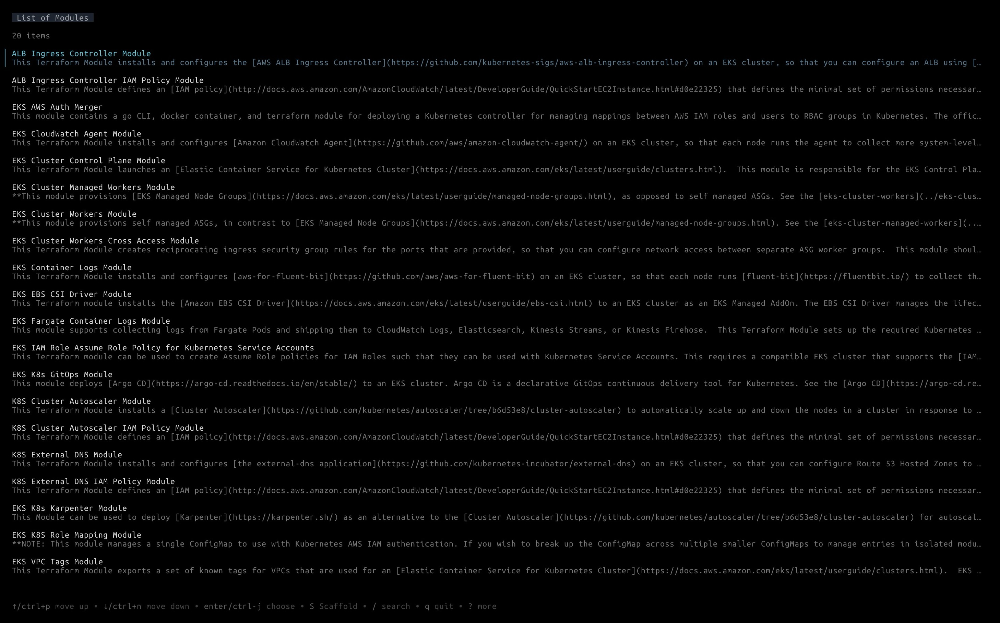

import { Aside } from '@astrojs/starlight/components';

Launch the user interface for searching and managing your module catalog.

```bash
terragrunt catalog <repo-url> [--no-include-root] [--root-file-name]
```



If `<repo-url>` is provided, the repository will be cloned into a temporary directory, otherwise:

1. The repository list are searched in the config file `terragrunt.hcl`. if `terragrunt.hcl` does not exist in the current directory, the config are searched in the parent directories.
1. If the repository list is not found in the configuration file, the modules are looked for in the current directory.

An example of how to define the optional default template and the list of repositories for the `catalog` command in the `terragrunt.hcl` configuration file:

``` hcl
# terragrunt.hcl
catalog {
  default_template = "git@github.com/acme/example.git//path/to/template"  # Optional default template to use for scaffolding
  urls = [
    "relative/path/to/repo", # will be converted to the absolute path, relative to the path of the configuration file.
    "/absolute/path/to/repo",
    "github.com/gruntwork-io/terraform-aws-lambda", # url to remote repository
    "http://github.com/gruntwork-io/terraform-aws-lambda", # same as above
  ]
  no_shell = true  # Optional: disable shell commands in boilerplate templates for security
  no_hooks = true  # Optional: disable hooks in boilerplate templates for security
}
```

This will recursively search for OpenTofu/Terraform modules in the root of the repo and the `modules` directory and show a table with all the modules. You can then:

1. Search and filter the table: `/` and start typing.
1. Select a module in the table: use the arrow keys to go up and down and next/previous page.
1. See the docs for a selected module: `ENTER`.
1. Use [`terragrunt scaffold`](/docs/features/scaffold/) to render a `terragrunt.hcl` for using the module: `S`.

## Security Configuration

The `catalog` block supports security-related configuration options:

- `no_shell` (bool): When set to `true`, disables shell command execution in boilerplate templates during scaffolding. This is useful for organizations that want to prevent the use of shell commands in templates for security reasons.
- `no_hooks` (bool): When set to `true`, disables hook execution in boilerplate templates during scaffolding. This is useful for organizations that want to prevent the use of hooks in templates for security reasons.

<Aside type="caution">

Do not use catalog/scaffold to scaffold untrusted templates. IaC configurations are inherently powerful, as they
can run arbitrary code on your system, so make sure to only use trusted templates you have reviewed and approved.

</Aside>

These configuration values can be overridden by their corresponding CLI flags:

```bash
terragrunt catalog --no-shell --no-hooks

terragrunt scaffold module-url --no-shell
```

**Priority order**: CLI flags > catalog configuration > defaults (both default to `false`, allowing `shell` and `hooks` to be used by default)

## Custom templates for scaffolding

Terragrunt has a basic template built-in for rendering `terragrunt.hcl` files, but you can provide your own templates to customize how code is generated! Scaffolding is done via [boilerplate](https://github.com/gruntwork-io/boilerplate), and Terragrunt allows you to specify custom boilerplate templates via two mechanisms while using catalog:

1. You can define a custom Boilerplate template in a `.boilerplate` sub-directory of any OpenTofu/Terraform module.
2. You can specify a custom Boilerplate template in the catalog configuration using the `default_template` option.

## Scaffolding Flags

The following `catalog` flags control behavior of the underlying `scaffold` command when the `S` key is pressed in a catalog entry:

- `--no-include-root` - Do not include the root configuration file in any generated `terragrunt.hcl` during scaffolding.
- `--root-file-name` - The name of the root configuration file to include in any generated `terragrunt.hcl` during scaffolding. This value also controls the name of the root configuration file to search for when trying to determine Catalog urls.
