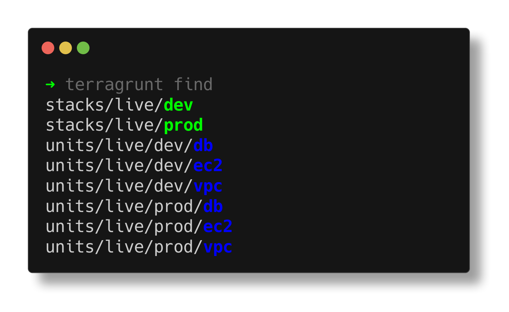
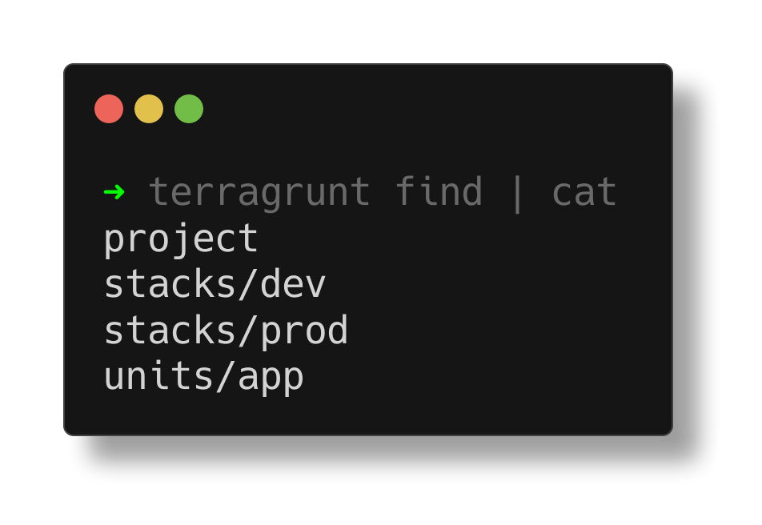

import { Aside, Badge } from '@astrojs/starlight/components';

## Color Output

When used without any flags, all units and stacks discovered in the current working directory are displayed in colorful text format.



<Aside type="note" title="Color Coding">

Discovered configurations are color coded to help you identify them at a glance:

- <Badge text="Units" style={{ backgroundColor: '#1B46DD', color: '#FFFFFF' }} /> are displayed in blue
- <Badge text="Stacks" style={{ backgroundColor: '#2E8B57', color: '#FFFFFF' }} /> are displayed in green

</Aside>

## Output Formats

The `find` command supports two output formats:

### Text Format (Default)

The default text format displays each configuration on a new line, with color coding for different types.

### JSON Format

You can output the results in JSON format using either:

```bash
terragrunt find --format=json
```

or the shorter alias:

```bash
terragrunt find --json
```

The JSON output includes additional metadata about each configuration, such as its type (unit or stack) and path.

## DAG Mode

The `find` command supports DAG mode to sort output based on dependencies using the `--dag` flag.

When using DAG mode, configurations with no dependencies appear first, followed by configurations that depend on them, maintaining the correct dependency order:

```bash
terragrunt find --dag
unitA           # no dependencies
unitB           # no dependencies
unitC           # depends on unitA
unitD           # depends on unitC
```

If multiple configurations share common dependencies, they will be sorted in lexical order.

## Queue Construct As

The `find` command supports the `--queue-construct-as` flag (or its shorter alias `--as`) to sort output based on the dependency graph, as if a particular command was run.

For example, when using the `plan` command:

```bash
terragrunt find --queue-construct-as=plan
stacks/live/dev
stacks/live/prod
units/live/dev/vpc
units/live/prod/vpc
units/live/dev/db
units/live/prod/db
units/live/dev/ec2
units/live/prod/ec2
```

This will sort the output based on the dependency graph, as if the `plan` command was run. All dependent units will appear *after* the units they depend on.

When using the `destroy` command:

```bash
terragrunt find --as=destroy
stacks/live/dev
stacks/live/prod
units/live/dev/ec2
units/live/prod/ec2
units/live/dev/db
units/live/prod/db
units/live/dev/vpc
units/live/prod/vpc
```

This will sort the output based on the dependency graph, as if the `destroy` command was run. All dependent units will appear *before* the units they depend on.

**Note:** The `--queue-construct-as` flag implies the `--dag` flag.

## Dependencies

You can include dependency information in the output using the `--dependencies` flag. When enabled, the JSON output will include the dependency relationships between configurations:

```bash
terragrunt find --dependencies --format=json
[
  {
    "type": "unit",
    "path": "unitA",
    "dependencies": []
  },
  {
    "type": "unit",
    "path": "unitB",
    "dependencies": ["../unitA", "../../external/unitC"]
  }
]
```

## Exclude Configuration

You can include exclude configuration in the output using the `--exclude` flag. When enabled, the JSON output will include the configurations of the `exclude` block in the discovered units:

```bash
terragrunt find --exclude --format=json
[
  {
    "type": "unit",
    "path": "action/exclude-apply",
    "exclude": {
      "exclude_dependencies": true,
      "actions": [
        "apply"
      ],
      "if": true
    }
  }
]
```

You can combine this with the `--queue-construct-as` flag to dry-run behavior relevant to excludes:

```bash
terragrunt find --exclude --queue-construct-as=plan --format=json
```

`find` will remove any units that would match the exclude configuration.

## Reading Files

You can include information about which files are read by each component using the `--reading` flag. This is particularly useful for understanding configuration dependencies and tracking which shared files are consumed by your Terragrunt configurations.

When enabled, the JSON output will include a `reading` field that lists all files that were read during the parsing of each component:

```bash
$ terragrunt find --reading --format=json
[
  {
    "type": "unit",
    "path": "app",
    "reading": [
      "path/to/shared.hcl",
      "path/to/shared.tfvars",
    ]
  }
]
```

This includes files read by Terragrunt helper functions such as:
- [`read_terragrunt_config()`](/docs/reference/hcl/functions/#read_terragrunt_config) - Reading other Terragrunt configuration files
- [`read_tfvars_file()`](/docs/reference/hcl/functions/#read_tfvars_file) - Reading Terraform variable files
- [`sops_decrypt_file()`](/docs/reference/hcl/functions/#sops_decrypt_file) - Reading encrypted files via SOPS
- [`mark_as_read()`](/docs/reference/hcl/functions/#mark_as_read) - Explicitly marking a file as read

## External Dependencies

By default, external dependencies (those outside the working directory) are not part of the overall results (although, they will be mentioned in the dependency section of the JSON output). Use the `--external` flag to include them as top-level results:

```bash
terragrunt find --dependencies --external --format=json
[
  {
    "type": "unit",
    "path": "internal/unitA",
    "dependencies": []
  },
  {
    "type": "unit",
    "path": "internal/unitB",
    "dependencies": ["../unitA", "../../external/unitC"]
  },
  {
    "type": "unit",
    "path": "external/unitC",
    "dependencies": []
  }
]
```

<Aside type="note" title="Automatic Dependency Discovery">

The `--external` flag automatically enables dependency discovery, so you don't need to explicitly pass `--dependencies` when using `--external` unless you want to actually see the dependency information.

The following commands are equivalent:

```bash
terragrunt find --external
terragrunt find --dependencies --external
```

As the default text format of `find` won't display dependency information anyways.

</Aside>

## Hidden Configurations

By default, hidden directories (those starting with `.`) are excluded from the search. Use the `--hidden` flag to include them:

```bash
terragrunt find --hidden
```

## Disabling Color Output

You can disable color output by using the global `--no-color` flag:

```bash
terragrunt find --no-color
```

When stdout is redirected, color output is disabled automatically to prevent undesired interference with other tools.



## Working Directory

You can change the working directory for `find` by using the global `--working-dir` flag:

```bash
terragrunt find --working-dir=/path/to/working/dir
```

## Filtering Results

<Aside type="tip" title="Experimental Feature">
This feature is currently experimental and not yet complete. See the [filter-flag experiment documentation](/docs/reference/experiments#filter-flag) for details on what is and isn't supported.

Usage of the filter flag requires usage of the `filter-flag` experiment, like so:

```bash
terragrunt find --experiment filter-flag --filter 'foo'
```

Examples below will omit the `--experiment filter-flag` flag for brevity.
</Aside>

The `find` command supports the `--filter` flag to target specific configurations using a flexible query language. This is particularly useful for discovering configurations that match specific criteria before running operations on them.

### Basic Filtering Examples

```bash
# Filter by name using glob patterns
terragrunt find --filter 'app*'

# Filter by path
terragrunt find --filter './prod/**'

# Filter by type
terragrunt find --filter 'type=unit'

# Combine filters with intersection
terragrunt find --filter './prod/** | type=unit'
```

### Advanced Filtering

The filter syntax supports negation, multiple filters, and complex queries:

```bash
# Exclude specific configurations
terragrunt find --experiment filter-flag --filter '!./test/**'

# Multiple filters (OR logic)
terragrunt find --experiment filter-flag --filter 'app1' --filter 'app2'

# Complex queries with chaining
terragrunt find --experiment filter-flag --filter './dev/** | type=unit | !name=unit1'
```

<Aside type="tip" title="Learn More About Filtering">

For comprehensive examples and advanced usage patterns, see the [Filters feature documentation](/docs/features/filter).

</Aside>
