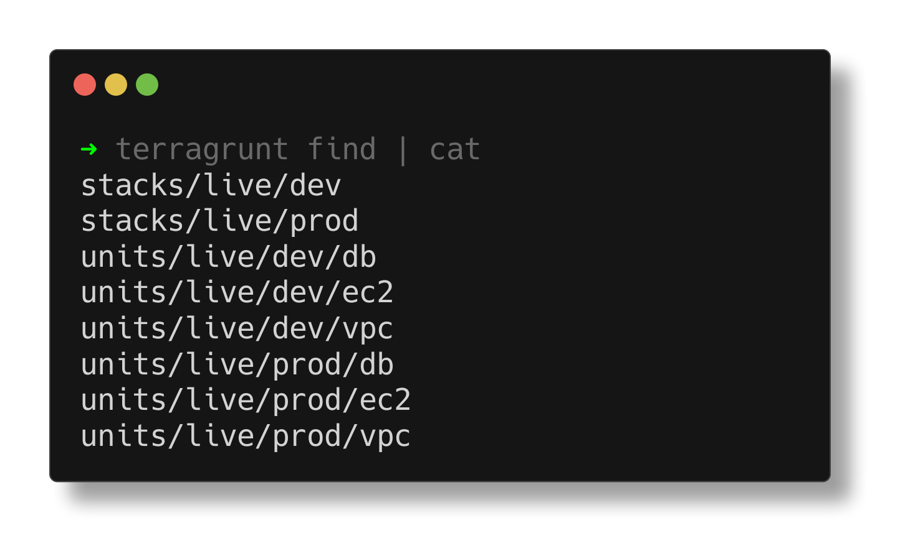

import { Aside, Badge } from '@astrojs/starlight/components';

## Color Output

When used without any flags, all units and stacks discovered in the current working directory are displayed in colorful text format.


<Aside type="note" title="Color Coding">

Discovered configurations are color coded to help you identify them at a glance:

- <Badge text="Units" style={{ backgroundColor: '#1B46DD', color: '#FFFFFF' }} /> are displayed in blue
- <Badge text="Stacks" style={{ backgroundColor: '#2E8B57', color: '#FFFFFF' }} /> are displayed in green

</Aside>

## Disabling Color Output

You can disable color output by using the global `--no-color` flag:

```bash
terragrunt find --no-color
```

When stdout is redirected, color output is disabled automatically to prevent undesired interference with other tools.



## Working Directory

You can change the working directory for `find` by using the global `--working-dir` flag:

```bash
terragrunt find --working-dir /path/to/working/dir
```
