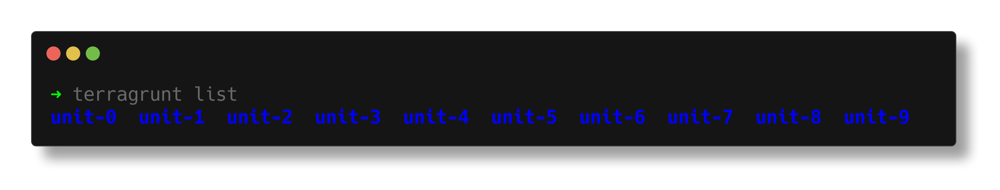
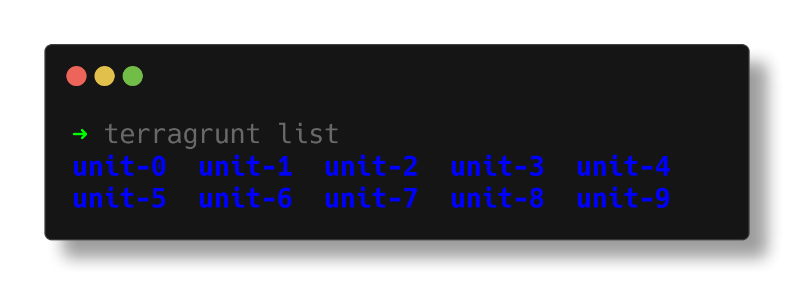
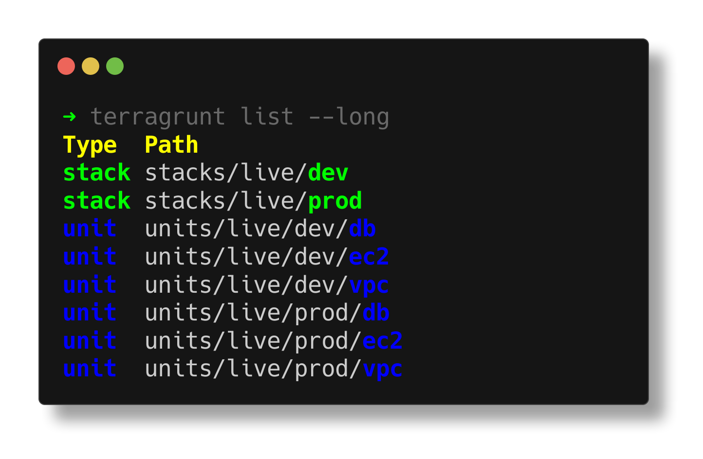
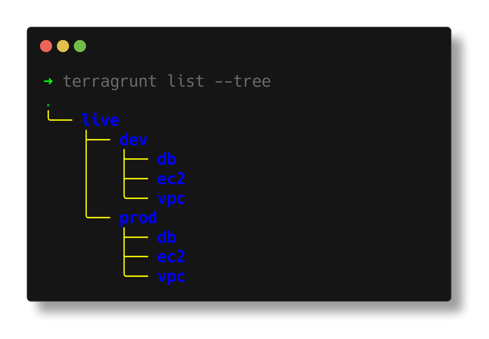

import { Aside, Badge } from '@astrojs/starlight/components';

## Output Formats

The `list` command supports multiple output formats to help you visualize your Terragrunt configurations in different ways:

### Text Format (Default)

The default text format provides a simple, space-separated list of configurations.



It will display all configurations that fit in the width of your terminal. When configurations exceed the width of your terminal, it will wrap to the next line.



### Long Format

The long format provides additional details about each configuration, including its type:



### Tree Format

The tree format provides a hierarchical view of your configurations:



By default, configurations in tree format are displayed ordered by name and grouped by directory:

```bash
.
╰── live
    ├── dev
    │   ├── db
    │   ├── ec2
    │   ╰── vpc
    ╰── prod
        ├── db
        ├── ec2
        ╰── vpc
```

### DOT Format

The DOT format outputs a directed acyclic graph (DAG) in DOT language format, which can be rendered as a visual dependency graph using tools like GraphViz.

```bash
$ terragrunt list --format=dot --dependencies
digraph {
  "live/dev/vpc" ;
  "live/dev/db" ;
  "live/dev/ec2" ;
  "live/dev/db" -> "live/dev/vpc";
  "live/dev/ec2" -> "live/dev/db";
  "live/dev/ec2" -> "live/dev/vpc";
  "live/prod/vpc" ;
  "live/prod/db" ;
  "live/prod/ec2" ;
  "live/prod/db" -> "live/prod/vpc";
  "live/prod/ec2" -> "live/prod/db";
  "live/prod/ec2" -> "live/prod/vpc";
}
```

You can render the DOT output to an image using GraphViz:

```bash
$ terragrunt list --format=dot --dependencies | dot -Tpng > graph.png
$ terragrunt list --format=dot --dependencies | dot -Tsvg > graph.svg
```

<Aside type="note" title="DOT Format Alias">

The `dag graph` command is an alias for `list --format=dot`. Both commands produce identical DOT format output:

```bash
terragrunt dag graph
# Equivalent to:
terragrunt list --format=dot --dependencies --external
```

</Aside>

## DAG Mode

The `list` command supports DAG mode to sort and group output based on dependencies using the `--dag` flag. When using DAG mode, configurations with no dependencies appear first, followed by configurations that depend on them, maintaining the correct dependency order.

For example, in default text format:

```bash
# Default alphabetical order
$ terragrunt list
a-dependent b-dependency

# DAG mode order
$ terragrunt list --dag
b-dependency a-dependent
```

When using `--dag` with the tree format, configurations are sorted by dependency order and grouped by relationship in the dependency graph:

```bash
$ terragrunt list --tree --dag
.
├── live/dev/vpc
│   ├── live/dev/db
│   │   ╰── live/dev/ec2
│   ╰── live/dev/ec2
╰── live/prod/vpc
    ├── live/prod/db
    │   ╰── live/prod/ec2
    ╰── live/prod/ec2
```

## Queue Construct As

The `list` command supports the `--queue-construct-as` flag (or its shorter alias `--as`) to sort output based on the dependency graph, as if a particular command was run.

For example, when using the `plan` command:

```bash
$ terragrunt list --queue-construct-as=plan
stacks/live/dev      stacks/live/prod     units/live/dev/vpc
units/live/prod/vpc  units/live/dev/db    units/live/prod/db
units/live/dev/ec2   units/live/prod/ec2
```

This will sort the output based on the dependency graph, as if the `plan` command was run. All dependent units will appear *after* the units they depend on.

When using the `destroy` command:

```bash
$ terragrunt list --queue-construct-as=destroy
stacks/live/dev      stacks/live/prod     units/live/dev/ec2
units/live/prod/ec2  units/live/dev/db    units/live/prod/db
units/live/dev/vpc   units/live/prod/vpc
```

This will sort the output based on the dependency graph, as if the `destroy` command was run. All dependent units will appear *before* the units they depend on.

**Note:** The `--queue-construct-as` flag implies the `--dag` flag.

## Dependencies and Discovery

### Dependencies

Include dependency information in the output using the `--dependencies` flag. When combined with different grouping options, this provides powerful ways to visualize your infrastructure's dependency structure.

### External Dependencies

Use the `--external` flag to discover and include dependencies that exist outside your current working directory. This is particularly useful when working with shared modules or cross-repository dependencies.

<Aside type="note" title="Automatic Dependency Discovery">

The `--external` flag automatically enables dependency discovery, so you don't need to explicitly pass `--dependencies` when using `--external`. The following commands are equivalent:

```bash
terragrunt list --external
terragrunt list --dependencies --external
```

This is because the default text format of `list` won't display dependency information anyways (as opposed to the `long` format, which does).

</Aside>

### Hidden Configurations

By default, Terragrunt excludes configurations in hidden directories (those starting with a dot). Use the `--hidden` flag to include these configurations in the output.

## Working Directory

You can change the working directory for `list` by using the global `--working-dir` flag:

```bash
terragrunt list --working-dir=/path/to/working/dir
```

## Color Output

When used without any flags, all units and stacks discovered in the current working directory are displayed in colorful text format.

<Aside type="note" title="Color Coding">
Discovered configurations are color coded to help you identify them at a glance:

- <Badge text="Units" style={{ backgroundColor: '#1B46DD', color: '#FFFFFF' }} /> are displayed in blue
- <Badge text="Stacks" style={{ backgroundColor: '#2E8B57', color: '#FFFFFF' }} /> are displayed in green
</Aside>

You can disable color output by using the global `--no-color` flag.

## Filtering Results

<Aside type="tip" title="Experimental Feature">
This feature is currently experimental and not yet complete. See the [filter-flag experiment documentation](/docs/reference/experiments#filter-flag) for details on what is and isn't supported.

Usage of the filter flag requires usage of the `filter-flag` experiment, like so:

```bash
terragrunt list --experiment filter-flag --filter 'foo'
```
</Aside>

The `list` command supports the `--filter` flag to target specific configurations using a flexible query language. This is particularly useful for listing configurations that match specific criteria before running operations on them.

### Basic Filtering Examples

```bash
# Filter by name using glob patterns
terragrunt list --experiment filter-flag --filter 'app*'

# Filter by path
terragrunt list --experiment filter-flag --filter './prod/**'

# Filter by type
terragrunt list --experiment filter-flag --filter 'type=unit'

# Combine filters with intersection
terragrunt list --experiment filter-flag --filter './prod/** | type=unit'
```

### Advanced Filtering

The filter syntax supports negation, multiple filters, and complex queries:

```bash
# Exclude specific configurations
terragrunt list --experiment filter-flag --filter '!./test/**'

# Multiple filters (OR logic)
terragrunt list --experiment filter-flag --filter 'app1' --filter 'app2'

# Complex queries with chaining
terragrunt list --experiment filter-flag --filter './dev/** | type=unit | !name=unit1'
```

<Aside type="tip" title="Learn More About Filtering">

For comprehensive examples and advanced usage patterns, see the [Filters feature documentation](/docs/features/filter).

</Aside>
