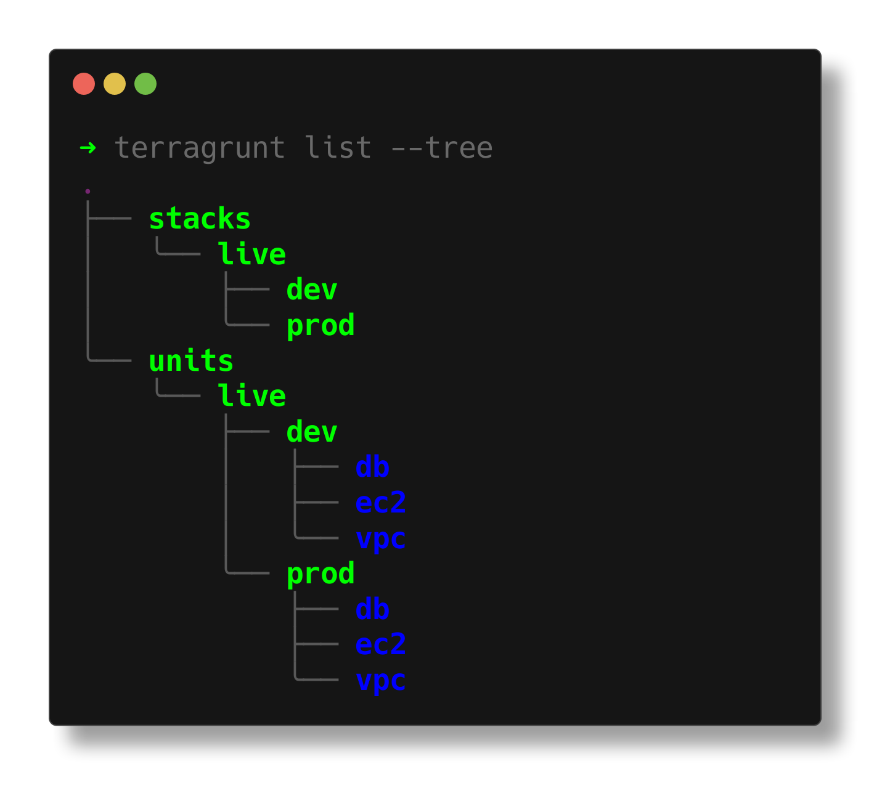

import { Aside, Badge } from '@astrojs/starlight/components';

## Output Formats

The `list` command supports multiple output formats to help you visualize your Terragrunt configurations in different ways:

### Text Format (Default)

The default text format provides a simple, space-separated list of configurations.


It will display all configurations that fit in the width of your terminal. When configurations exceed the width of your terminal, it will wrap to the next line.


### Long Format

The long format provides additional details about each configuration, including its type:


### Tree Format

The tree format provides a hierarchical view of your configurations:



## Sorting and Grouping

The `list` command supports different sorting and grouping options to help you organize output:

### Sorting

- `alpha` (default): Sort configurations alphabetically by path
- `dag`: Sort configurations based on their dependencies

### Grouping

The `--group-by` flag controls how dependencies are represented in the output:

- `fs` (default): Shows dependencies as nested lists with entries as children of parent directories
- `dag`: Shows dependencies in a tree structure from a DAG perspective

<Aside type="tip">
  The `--dag` flag is a shorthand that sets both `--sort=dag` and `--group-by=dag`.
</Aside>

## Dependencies and Discovery

### Dependencies

Include dependency information in the output using the `--dependencies` flag. When combined with different grouping options, this provides powerful ways to visualize your infrastructure's dependency structure.

### External Dependencies

Use the `--external` flag to discover and include dependencies that exist outside your current working directory. This is particularly useful when working with shared modules or cross-repository dependencies.

### Hidden Configurations

By default, Terragrunt excludes configurations in hidden directories (those starting with a dot). Use the `--hidden` flag to include these configurations in the output.

## Working Directory

You can change the working directory for `list` by using the global `--working-dir` flag:

```bash
terragrunt list --working-dir=/path/to/working/dir
```

## Color Output

When used without any flags, all units and stacks discovered in the current working directory are displayed in colorful text format.

<Aside type="note" title="Color Coding">
Discovered configurations are color coded to help you identify them at a glance:

- <Badge text="Units" style={{ backgroundColor: '#1B46DD', color: '#FFFFFF' }} /> are displayed in blue
- <Badge text="Stacks" style={{ backgroundColor: '#2E8B57', color: '#FFFFFF' }} /> are displayed in green
</Aside>

You can disable color output by using the global `--no-color` flag.
