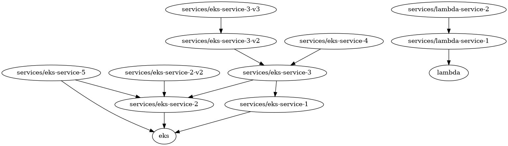

import { Aside } from '@astrojs/starlight/components';

When this flag is set, Terragrunt will run the specified OpenTofu/Terraform command against the graph of dependencies for the unit in the current working directory. The graph consists of all units that depend on the unit in the current working directory via a `dependency` or `dependencies` blocks, plus all the units that depend on those units, and all the units that depend on those units, and so on, recursively up the tree, up to the Git repository root.

The command will be executed following the order of dependencies: it'll run on the unit in the current working directory first, then on units that depend on it directly, then on the units that depend on those units, and so on. Note that if the command is `destroy`, it will run in the opposite order (the final dependents, then their dependencies, etc. up to the unit you ran the command in).

## Example Usage

Given the following dependency graph:



Running `terragrunt run --graph plan` in the `eks` module will lead to the following execution order:

```text
Group 1
- Module project/eks

Group 2
- Module project/services/eks-service-1
- Module project/services/eks-service-2

Group 3
- Module project/services/eks-service-2-v2
- Module project/services/eks-service-3
- Module project/services/eks-service-5

Group 4
- Module project/services/eks-service-3-v2
- Module project/services/eks-service-4

Group 5
- Module project/services/eks-service-3-v3
```

Notes:
- `lambda` units aren't included in the graph because they are not dependent on the `eks` unit
- Execution is from bottom up based on dependencies

Running `terragrunt run --graph destroy` in the `eks` unit will lead to the following execution order:

```text
Group 1
- Module project/services/eks-service-2-v2
- Module project/services/eks-service-3-v3
- Module project/services/eks-service-4
- Module project/services/eks-service-5

Group 2
- Module project/services/eks-service-3-v2

Group 3
- Module project/services/eks-service-3

Group 4
- Module project/services/eks-service-1
- Module project/services/eks-service-2

Group 5
- Module project/eks
```

Notes:
- Execution is in reverse order; first are destroyed "top" units and in the end `eks`
- `lambda` units aren't affected at all

To learn more about how to use this flag, see the [Stacks](/docs/features/stacks) feature documentation.

<Aside type="caution">
When running `graph destroy`, the execution order is reversed compared to other commands. Dependencies will be destroyed in reverse order to ensure resources are safely removed (dependents are destroyed before their dependencies).

Always verify the execution plan before running destructive commands.
</Aside>

<Aside type="danger">
External dependencies (units outside your current working directory) are not automatically included in graph runs.

You must explicitly include them using [`--queue-include-external`](/docs/reference/cli/commands/run#queue-include-external) if they need to be part of the execution.
</Aside>
