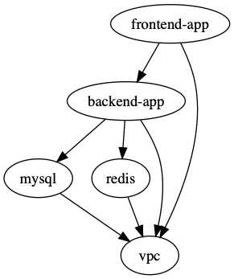

import FileTree from '@components/vendored/starlight/FileTree.astro';
import { Aside } from '@astrojs/starlight/components';

## Passing outputs between units

Consider the following file structure:

<FileTree>

- root
  - backend-app
    - terragrunt.hcl
  - mysql
    - terragrunt.hcl
  - valkey
    - terragrunt.hcl
  - vpc
    - terragrunt.hcl

</FileTree>

Suppose that you wanted to pass in the VPC ID of the VPC that is created from the `vpc` unit in the directory structure above to the `mysql` unit as an input variable. Or that you wanted to pass in the subnet IDs of the private subnet that is allocated as part of the `vpc` unit.

You can use the `dependency` block to extract those outputs and use them as `inputs` to the `mysql` unit.

For example, suppose the `vpc` unit outputs the ID under the output named `vpc_id`. To access that output, you would specify in `mysql/terragrunt.hcl`:

```hcl
# mysql/terragrunt.hcl
dependency "vpc" {
  config_path = "../vpc"
}

inputs = {
  vpc_id = dependency.vpc.outputs.vpc_id
}
```

When you apply this unit, the output will be read from the `vpc` unit and passed in as an input to the `mysql` unit right before calling `tofu apply`/`terraform apply`.

You can also specify multiple `dependency` blocks to access the outputs of multiple units.

For example, in the above folder structure, you might want to reference the `domain` output of the `valkey` and `mysql` units for use as `inputs` in the `backend-app` unit. To access those outputs, you would specify the following in `backend-app/terragrunt.hcl`:

```hcl
# backend-app/terragrunt.hcl
dependency "mysql" {
  config_path = "../mysql"
}

dependency "valkey" {
  config_path = "../valkey"
}

inputs = {
  mysql_url = dependency.mysql.outputs.domain
  valkey_url = dependency.valkey.outputs.domain
}
```

Note that each `dependency` block results in a relevant status in the Terragrunt [DAG](/getting-started/terminology/#directed-acyclic-graph-dag). This means that when you run `run --all apply` on a config that has `dependency` blocks, Terragrunt will not attempt to deploy the config until all the units referenced in `dependency` blocks have been applied. So for the above example, the order for the `run --all apply` command would be:

1. Deploy the VPC

2. Deploy MySQL and valkey in parallel

3. Deploy the backend-app

If any of the units failed to deploy, then Terragrunt will not attempt to deploy the units that depend on them.

**Note**: Not all blocks can access outputs passed by `dependency` blocks. See the section on [Configuration parsing order](/reference/hcl#configuration-parsing-order) for more information.

### Unapplied dependency and mock outputs

Terragrunt will return an error if the unit referenced in a `dependency` block has not been applied yet. This is because you cannot actually fetch outputs out of an unapplied unit, even if there are no resources being created in the unit.

This is most problematic when running commands that do not modify state (e.g `run --all plan` and `run --all validate`) on a completely new setup where no infrastructure has been deployed. You won't be able to `plan` or `validate` a unit if you can't determine the `inputs`. If the unit depends on the outputs of another unit that hasn't been applied yet, you won't be able to compute the `inputs` unless the dependencies are all applied.

Of course, in real life usage, you typically need the ability to run `run --all validate` or `run --all plan` on a completely new set of infrastructure.

To address this, you can provide mock outputs to use when a unit hasn't been applied yet. This is configured using the `mock_outputs` attribute on the `dependency` block and it corresponds to a map that will be injected in place of the actual dependency outputs if the target config hasn't been applied yet.

Using a mock output is typically the best solution here, as you typically don't actually care that an _accurate_ value is used for a given value at this stage, just that it will plan successfully. When you actually apply the unit, that's when you want to be sure that a real value is used.

For example, in the previous scenario with a `mysql` unit and `vpc` unit, suppose you wanted to mock a value for the `vpc_id` during a `run --all validate` for the `mysql` unit.

You can specify that in `mysql/terragrunt.hcl`:

```hcl
# mysql/terragrunt.hcl
dependency "vpc" {
  config_path = "../vpc"

  mock_outputs = {
    vpc_id = "mock-vpc-id"
  }
}

inputs = {
  vpc_id = dependency.vpc.outputs.vpc_id
}
```

You can now run `validate` on this config before the `vpc` unit is applied because Terragrunt will use the map `{vpc_id = "mock-vpc-id"}` as the `outputs` attribute on the dependency instead of erroring out.

What if you wanted to restrict this behavior to only the `validate` command? For example, you might not want to use the defaults for a `plan` operation because the plan doesn't give you any indication of what is actually going to be created.

You can use the `mock_outputs_allowed_terraform_commands` attribute to indicate that the `mock_outputs` should only be used when running those OpenTofu/Terraform commands. So to restrict the `mock_outputs` to only when `validate` is being run, you can modify the above `terragrunt.hcl` file to:

```hcl
# mysql/terragrunt.hcl
dependency "vpc" {
  config_path = "../vpc"

  mock_outputs = {
    vpc_id = "temporary-dummy-id"
  }

  mock_outputs_allowed_terraform_commands = ["validate"]
}

inputs = {
  vpc_id = dependency.vpc.outputs.vpc_id
}
```

Note that indicating `validate` means that the `mock_outputs` will be used either with `validate` or with `run --all validate`.

You can also use `skip_outputs` on the `dependency` block to specify the dependency without pulling in the outputs:

```hcl
# mysql/terragrunt.hcl
dependency "vpc" {
  config_path = "../vpc"

  skip_outputs = true
}
```

When `skip_outputs` is used with `mock_outputs`, mocked outputs will be returned without attempting to load outputs from OpenTofu/Terraform.

This can be useful when you disable backend initialization (`remote_state.disable_init`) in CI for example.

```hcl
# mysql/terragrunt.hcl
dependency "vpc" {
  config_path = "../vpc"

  mock_outputs = {
    vpc_id = "temporary-dummy-id"
  }

  skip_outputs = true
}
```

You can also use `mock_outputs_merge_strategy_with_state` on the `dependency` block to merge mocked outputs and real outputs:

```hcl
# mysql/terragrunt.hcl
dependency "vpc" {
  config_path = "../vpc"

  mock_outputs = {
    vpc_id     = "temporary-dummy-id"
    new_output = "temporary-dummy-value"
  }

  mock_outputs_merge_strategy_with_state = "shallow"
}
```

If real outputs only contain `vpc_id`, `dependency.outputs` will contain a real value for `vpc_id` and a mocked value for `new_output`.

### Passing outputs between units in explicit stacks

When defining units using a `terragrunt.stack.hcl` file, you might need to perform some indirection to pass outputs between units, as the dependency relationship of each unit is explicitly defined in each unit's `terragrunt.hcl` file.

For example, say you wanted to generate the stack above using the following `terragrunt.stack.hcl` file:

```hcl
# terragrunt.stack.hcl

unit "vpc" {
  source = "github.com/acme/infrastructure-catalog//units/vpc?ref=v1.0.0"
  path   = "vpc"
}

unit "mysql" {
  source = "github.com/acme/infrastructure-catalog//units/mysql?ref=v1.0.0"
  path   = "mysql"
}

unit "valkey" {
  source = "github.com/acme/infrastructure-catalog//units/valkey?ref=v1.0.0"
  path   = "valkey"
}

unit "backend_app" {
  source = "github.com/acme/infrastructure-catalog//units/backend-app?ref=v1.0.0"
  path   = "backend-app"
}
```

Generating this stack would generate the following:

<FileTree>

- .terragrunt-stack
  - vpc
    - terragrunt.hcl
  - mysql
    - terragrunt.hcl
  - valkey
    - terragrunt.hcl
  - backend-app
    - terragrunt.hcl

</FileTree>

The `backend-app` unit would need to access the outputs of the `mysql` and `valkey` units to use as inputs. To do this, you can use the `dependency` block to access the outputs of the `mysql` and `backend-app` units.

```hcl
# github.com/acme/infrastructure-catalog//units/mysql/terragrunt.hcl
dependency "vpc" {
  config_path = values.vpc_path
}

inputs = {
  vpc_id = dependency.vpc.outputs.vpc_id
}
```

```hcl
# github.com/acme/infrastructure-catalog//units/backend-app/terragrunt.hcl
dependency "mysql" {
  config_path = values.mysql_path
}

dependency "valkey" {
  config_path = values.valkey_path
}

inputs = {
  mysql_url = dependency.mysql.outputs.domain
  valkey_url = dependency.valkey.outputs.domain
}
```

And update the `terragrunt.stack.hcl` file to:

```hcl
# terragrunt.stack.hcl

unit "vpc" {
  source = "github.com/acme/infrastructure-catalog//units/vpc?ref=v1.0.0"
  path   = "vpc"
}

unit "mysql" {
  source = "github.com/acme/infrastructure-catalog//units/mysql?ref=v1.0.0"
  path   = "mysql"
  values = {
    vpc_path = "../vpc"
  }
}

unit "valkey" {
  source = "github.com/acme/infrastructure-catalog//units/valkey?ref=v1.0.0"
  path   = "valkey"
  values = {
    vpc_path = "../vpc"
  }
}

unit "backend_app" {
  source = "github.com/acme/infrastructure-catalog//units/backend-app?ref=v1.0.0"
  path   = "backend-app"
  values = {
    mysql_path  = "../mysql"
    valkey_path = "../valkey"
  }
}
```

Following this pattern, the path to dependencies are passed in as `values` to the unit, and units themselves define dependency blocks that utilize those values.

<Aside type="note">
You might not like this design!

Take a look at RFC [#4067](https://github.com/gruntwork-io/terragrunt/issues/4067) for an alternate proposal from a member of the Terragrunt community, and follow the conversation there.
</Aside>

## Dependencies between units

You can also specify dependencies without accessing any of the outputs of units. Consider the following file structure:

<FileTree>

- root
  - backend-app
    - terragrunt.hcl
  - frontend-app
    - terragrunt.hcl
  - mysql
    - terragrunt.hcl
  - valkey
    - terragrunt.hcl
  - vpc
    - terragrunt.hcl

</FileTree>

Let's assume you have the following dependencies between OpenTofu/Terraform units:

- `backend-app` depends on `mysql`, `valkey`, and `vpc`

- `frontend-app` depends on `backend-app` and `vpc`

- `mysql` depends on `vpc`

- `valkey` depends on `vpc`

- `vpc` has no dependencies

You can express these dependencies in your `terragrunt.hcl` config files using a `dependencies` block. For example, in `backend-app/terragrunt.hcl` you would specify:

``` hcl
# backend-app/terragrunt.hcl
dependencies {
  paths = ["../vpc", "../mysql", "../valkey"]
}
```

Similarly, in `frontend-app/terragrunt.hcl`, you would specify:

``` hcl
# frontend-app/terragrunt.hcl
dependencies {
  paths = ["../vpc", "../backend-app"]
}
```

Once you've specified these dependencies in each `terragrunt.hcl` file, Terragrunt will be able to perform updates respecting the [DAG](/getting-started/terminology/#directed-acyclic-graph-dag) of dependencies.

For the example at the start of this section, the order of runs for the `run --all apply` command would be:

1. Deploy the VPC

2. Deploy MySQL and valkey in parallel

3. Deploy the backend-app

4. Deploy the frontend-app

Any error encountered in an individual unit during a `run --all` command will prevent Terragrunt from proceeding with the deployment of any dependent units.

To check all of your dependencies and validate the code in them, you can use the `run --all validate` command.

<Aside type="note">
During `destroy` runs, Terragrunt will try to find all dependent units and show a confirmation prompt with a list of detected dependencies.

This is because Terragrunt knows that once resources in a dependency are destroyed, any commands run on dependent units may fail.

For example, if `destroy` was called on the `Valkey` unit, you'd be asked for confirmation, as the `backend-app` depends on `Valkey`. You can suppress the prompt by using the `--non-interactive` flag.
</Aside>

## Visualizing the DAG

To visualize the dependency graph you can use the `dag graph` command (similar to the `tofu/terraform graph` command), or its equivalent `list --format=dot --dependencies --external` command.

The graph is output in DOT format. The typical program used to render this file format is GraphViz, but many web services are available that can do this as well.

```bash
terragrunt dag graph | dot -Tsvg > graph.svg
# Or equivalently:
terragrunt list --format=dot --dependencies --external | dot -Tsvg > graph.svg
```

The example above generates the following graph:



Note that this graph shows the dependency relationship in the direction of the arrow, with the tip pointing to the dependency (e.g. `frontend-app` depends on `backend-app`).

For plans and applies, Terragrunt will run units in the opposite direction, however (e.g. `backend-app` would be applied before `frontend-app`).

The exception to this rule is during the `destroy` (and `plan/apply -destroy`) commands, where Terragrunt will run in the direction of the arrow (e.g. `frontend-app` would be destroyed before `backend-app`).

## Testing multiple units locally

If you are using Terragrunt to download [remote OpenTofu/Terraform modules](/features/units/#remote-opentofuterraform-modules) and all of your units have the `source` parameter set to a Git URL, but you want to test with a local checkout of the code, you can use the `--source` parameter to override that value:

```bash
terragrunt run --all --source /source/modules -- plan
```

If you set the `--source` parameter, the `run --all` command will assume that parameter is pointing to a folder on your local file system that has a local checkout of all of your OpenTofu/Terraform modules.

For each unit that is being processed via a `run --all` command, Terragrunt will:

1. Read in the `source` parameter in that unit's `terragrunt.hcl` file.
2. Parse out the path (the portion after the double-slash).
3. Append the path to the `--source` parameter to create the final local path for that unit.

For example, consider the following `terragrunt.hcl` file:

``` hcl
# terragrunt.hcl

terraform {
  source = "git::git@github.com:acme/infrastructure-modules.git//networking/vpc?ref=v0.0.1"
}
```

Running the following:

```bash
terragrunt run --all --source /source/infrastructure-modules -- apply
```

Will result in a unit with the configuration for the source above being resolved to `/source/infrastructure-modules//networking/vpc`.

## Limiting run parallelism

By default, Terragrunt will not impose a limit on the number of units it executes when it traverses the dependency graph,
meaning that if it finds 5 units without dependencies, it'll run OpenTofu/Terraform 5 times in parallel, once in each unit.

Sometimes, this can create a problem if there are a lot of units in the dependency graph, like hitting a rate limit on a
cloud provider.

To limit the maximum number of unit executions at any given time use the `--parallelism [number]` flag

```sh
terragrunt run --all --parallelism 4 -- apply
```

## Limiting stack output parallelism

`terragrunt stack output` fetches outputs from every unit concurrently. Each fetch spawns a `tofu output` child process, so very large stacks may need a cap to avoid file-descriptor exhaustion or hitting cloud-provider rate limits. The same `--parallelism` flag bounds the number of concurrent unit fetches:

```sh
terragrunt stack output --parallelism 4
```

## Saving OpenTofu/Terraform plan output

A powerful feature of OpenTofu/Terraform is the ability to save the result of a plan as a binary file using the [-out flag](https://opentofu.org/docs/cli/commands/plan/).

Terragrunt provides special tooling in `run --all` execution to ensure that the saved plan for a `run --all` against a stack has
a corresponding entry for each unit in the stack in a directory structure that mirrors the stack structure.

To save every plan generated when running a stack, use the `--out-dir` flag (or `TG_OUT_DIR` environment variable) as demonstrated below:

```bash
$ terragrunt run --all --out-dir /tmp/tfplan -- plan
```

<FileTree>

- app1
  - tfplan.tfplan
- app2
  - tfplan.tfplan
- app3
  - tfplan.tfplan
- project-2
  - project-2-app1
    - tfplan.tfplan

</FileTree>

This integration also exists for the `apply` command, where the generated plan will be used when performing the apply.

```bash
$ terragrunt run --all --out-dir /tmp/tfplan -- apply
```

For planning a destroy operation, use the following commands:

```bash
terragrunt run --all --out-dir /tmp/tfplan -- plan -destroy
terragrunt run --all --out-dir /tmp/tfplan -- apply
```

<Aside type="caution">

If you are leveraging [mock outputs](#unapplied-dependency-and-mock-outputs) in your stack, you may get unexpected results when applying saved plans, as the plans will have mock outputs in them.

There's a workaround documented [here](https://github.com/gruntwork-io/terragrunt/issues/2178#issuecomment-2615842856), but no first-class feature in Terragrunt to address this issue, currently.

If you would like Terragrunt to have first-class support for a solution to this, please [create an RFC](https://github.com/gruntwork-io/terragrunt/issues/new?template=03-rfc.yml) to propose it.

</Aside>

To save plans in json format use the `--json-out-dir` flag:

```bash
terragrunt run --all --json-out-dir /tmp/json -- plan
```

<FileTree>

- app1
  - tfplan.json
- app2
  - tfplan.json
- app3
  - tfplan.json
- project-2
  - project-2-app1
    - tfplan.json

</FileTree>


```bash
terragrunt run --all --out-dir /tmp/all --json-out-dir /tmp/all -- plan
```

<FileTree>

- app1
  - tfplan.json
  - tfplan.tfplan
- app2
  - tfplan.json
  - tfplan.tfplan
- app3
  - tfplan.json
  - tfplan.tfplan
- project-2
  - project-2-app1
    - tfplan.json
    - tfplan.tfplan

</FileTree>

## Nested Stacks

Note that you can also have nested stacks.

For example, consider the following file structure:

<FileTree>

- root
  - us-east-1
    - app
      - terragrunt.hcl
    - db
      - terragrunt.hcl
  - us-west-2
    - app
      - terragrunt.hcl
    - db
      - terragrunt.hcl

</FileTree>

In this example, there's the `root` stack, that contains all the infrastructure you've defined so far,
and there's also the `us-east-1` and `us-west-2` stacks, that contain the infrastructure for the `app` and `db` units in those regions.

You can run `run --all` commands at any depth of the stack to run the units in that stack and all of its children.

For example, to run all the units in the `us-east-1` stack, you can run:

```sh
cd root/us-east-1
terragrunt run --all apply
```

Terragrunt will only include the units in the `us-east-1` stack and its children in the queue of units to run.

This is the primary tool Terragrunt users use to control the blast radius of their changes. For the most part, it is the current working directory that determines the blast radius of a `run --all` command.

In addition to using your working directory to control what's included in a [run queue](/getting-started/terminology/#run-queue), you can also use [Filters](/features/filter/) to control this.

There are more flags that control the behavior of the `run` command, which you can find in the [`run` docs](/reference/cli/commands/run).
