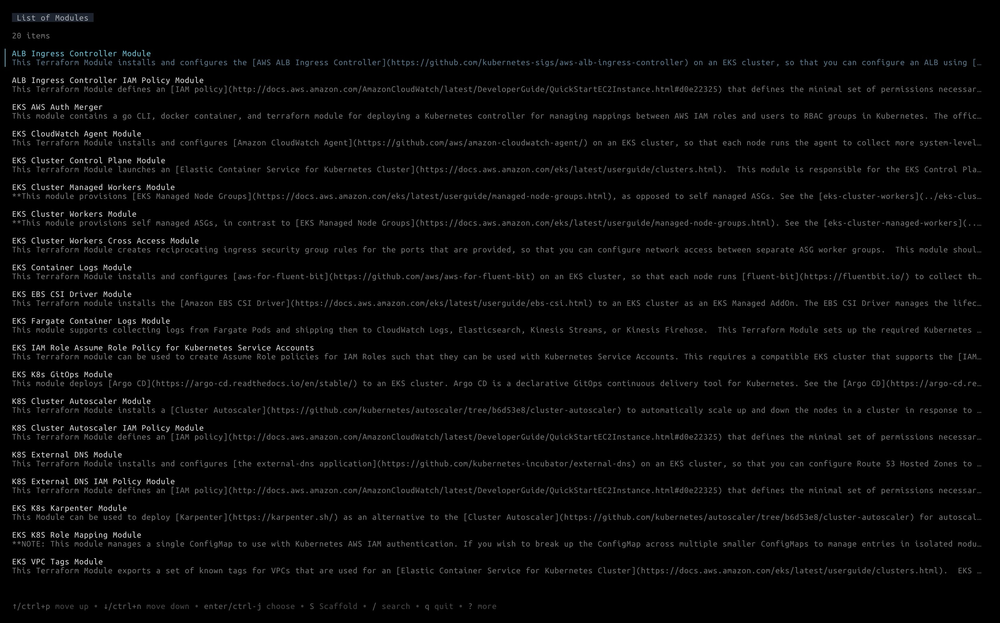

import { Aside } from '@astrojs/starlight/components';
import Since from '@components/Since.astro';
import Before from '@components/Before.astro';

Launch the user interface for searching and managing your module catalog.

```bash
terragrunt catalog <repo-url> [--no-include-root] [--root-file-name]
```



If `<repo-url>` is provided, the repository will be cloned into a temporary directory, otherwise:

1. The repository list are searched in the config file `terragrunt.hcl`. if `terragrunt.hcl` does not exist in the current directory, the config are searched in the parent directories.
1. If the repository list is not found in the configuration file, the modules are looked for in the current directory.

An example of how to define the optional default template and the list of repositories for the `catalog` command in the `terragrunt.hcl` configuration file:

``` hcl
# terragrunt.hcl
catalog {
  default_template = "git@github.com/acme/example.git//path/to/template"  # Optional default template to use for scaffolding
  urls = [
    "relative/path/to/repo", # will be converted to the absolute path, relative to the path of the configuration file.
    "/absolute/path/to/repo",
    "github.com/gruntwork-io/terraform-aws-lambda", # url to remote repository
    "http://github.com/gruntwork-io/terraform-aws-lambda", # same as above
  ]
  no_shell = true  # Optional: disable shell commands in boilerplate templates for security
  no_hooks = true  # Optional: disable hooks in boilerplate templates for security
}
```

This will recursively search for OpenTofu/Terraform modules in the root of the repo and the `modules` directory and show a table with all the modules. You can then:

1. Search and filter the table: `/` and start typing.
1. Select a module in the table: use the arrow keys to go up and down and next/previous page.
1. See the docs for a selected module: `ENTER`.
1. Use [`terragrunt scaffold`](/features/catalog/scaffold) to render a `terragrunt.hcl` for using the module: `S`.

## Scaffolding Flags

The following `catalog` flags control behavior of the underlying `scaffold` command when the `S` key is pressed in a catalog entry:

- `--no-include-root` - Do not include the root configuration file in any generated `terragrunt.hcl` during scaffolding.
- `--root-file-name` - The name of the root configuration file to include in any generated `terragrunt.hcl` during scaffolding. This value also controls the name of the root configuration file to search for when trying to determine Catalog urls.

## Excluding paths from discovery

<Aside type="tip" title="Catalog Redesign Experiment">
This section describes behavior that is only available when the [`catalog-redesign`](/reference/experiments/active#catalog-redesign) experiment is enabled.
</Aside>

Catalog authors can keep directories out of discovery by committing a `.terragrunt-catalog-ignore` file at the root of the repository. Typical uses are skipping `examples/`, `test/`, or integration fixtures that aren't intended to be scaffolded as modules or templates.

The file format borrows from `.gitignore`:

- One pattern per line. Blank lines and lines starting with `#` are ignored.
- Patterns are matched against repo-relative, forward-slash paths (e.g. `examples/vpc`). A lone `*` does not cross `/`; use `**` to match across path separators.
- A leading `!` negates a previous rule, re-including a sibling that an earlier pattern excluded.
- Trailing `/` is optional and ignored.
- The last matching rule wins.

Matching evaluates every path against the rule list in order, so a later `!` pattern can re-include a path that an earlier rule excluded, including a descendant of a previously matched directory.

```plaintext
# .terragrunt-catalog-ignore

# Keep examples out of the catalog.
examples
examples/**

# Skip everything under test/ except test/keep.
test/**
!test/keep
```

With the file above, a repo containing `modules/vpc/main.tf`, `examples/vpc/main.tf`, `test/drop/main.tf`, and `test/keep/main.tf` surfaces only `modules/vpc` and `test/keep` in the catalog.

### Layering an additional ignore file

Pass `--ignore-file <path>` to load an additional ignore file on top of whatever `.terragrunt-catalog-ignore` is committed at the repo root. The extra rules are appended after the repo's rules, so last-match-wins semantics let the extra file either add new exclusions or re-include paths the repo file excluded via `!` negation.

```bash
terragrunt catalog --ignore-file ./my-ignore-rules
```

This is useful when you don't control the upstream repository, or when you want to temporarily scope discovery without editing files under version control. It can also be set via the `TG_IGNORE_FILE` environment variable. The path must exist; a missing file is an error.

## Browse tabs


<Aside type="tip" title="Catalog Redesign Experiment">
This section describes behavior that is only available when the [`catalog-redesign`](/reference/experiments/active#catalog-redesign) experiment is enabled.
</Aside>

The list view is split into three tabs: `All`, `Modules`, and `Templates`. `All` is selected when the TUI launches. Press `tab` to move to the next tab and `shift+tab` to move to the previous; cycling wraps at either end. The active tab filters the list down to components of that kind, and each tab keeps its own cursor position and search filter, so switching back preserves where you were.

## README front-matter

<Aside type="tip" title="Catalog Redesign Experiment">
This section describes behavior that is only available when the [`catalog-redesign`](/reference/experiments/active#catalog-redesign) experiment is enabled.
</Aside>

Component authors can override the catalog UI's default title and description by adding a YAML block at the top of the component's `README.md`. Two forms are accepted.

The conventional dash-separated form:

```markdown
---
name: VPC App
description: A VPC for application workloads.
---

# VPC App

...
```

An HTML-comment-wrapped form, which stays invisible on Markdown viewers that render dash-separated front-matter as a horizontal rule. The opening tag must be `<!-- Frontmatter` (case-insensitive):

```markdown
<!-- Frontmatter
name: VPC App
description: A VPC for application workloads.
-->

# VPC App

...
```

Both forms are parsed the same way.

Recognized keys:

- `name`: the component title shown in the list view. When unset, the title falls back to the first `# H1` heading in the README, then to the directory name.
- `description`: the short description shown beneath the title in the list view. When unset, it is derived from the README body.

A third key, `tags`, controls the colored pills shown next to each component; see the next section. Unknown keys are ignored.

## Component tags

<Aside type="tip" title="Catalog Redesign Experiment">
This section describes behavior that is only available when the [`catalog-redesign`](/reference/experiments/active#catalog-redesign) experiment is enabled.
</Aside>

<Before version="1.0.4">

In a future release, the catalog UI will read tag information from the front-matter of component `README.md` files.

</Before>

<Since version="1.0.4">

Catalog authors can attach tags to a component by adding a `tags` key to the component's `README.md` front-matter. Tags appear as colored pills next to the component in the list view, and as a row above the rendered README in the detail view.

Either inline-array or dash-list YAML form is accepted:

```markdown
<!-- Frontmatter
name: VPC App
description: A VPC for application workloads.
tags: [networking, aws, module]
-->
```

```markdown
<!-- Frontmatter
name: VPC App
tags:
  - networking
  - aws
  - module
-->
```

Tag values that name a component type also promote the component into that type's tab. For example, a component classified as a `template` whose tags include `module` appears under both the `Templates` tab (by its native kind) and the `Modules` tab (by tag), without changing how it's scaffolded.

</Since>
